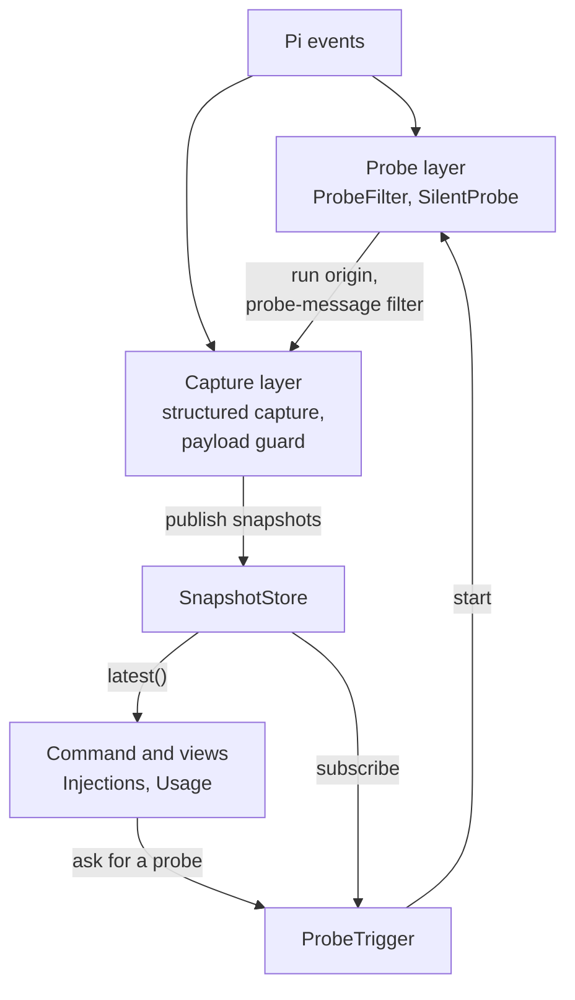

# Architecture

How `pi-context-view` observes Pi's requests and turns them into the two views,
and the rules that changes must preserve. This file holds the overview, the
layers, the module boundaries, and the required invariants.

| Document                                                       | Covers                                                                                             |
| -------------------------------------------------------------- | -------------------------------------------------------------------------------------------------- |
| [architecture/pi-requests.md](architecture/pi-requests.md)     | How Pi prepares a request, handler order, supported Pi versions, Pi APIs used, side effects        |
| [architecture/capture.md](architecture/capture.md)             | Structured request capture: baseline, request copy, diff, attribution, hidden tools, SnapshotStore |
| [architecture/payload-guard.md](architecture/payload-guard.md) | Payload pairing, dispatch confirmation, parsers, tool and message channels, Pi's own adjustments   |
| [architecture/views.md](architecture/views.md)                 | Injections and Usage on snapshots, the differences between them, the one-request limitation        |
| [architecture/probe.md](architecture/probe.md)                 | Silent probe: trigger, lifecycle, run identity, probe messages, preconditions, side effects        |
| [architecture/measurement.md](architecture/measurement.md)     | Token estimates, prompt parts, tool ownership, prompt additions, totals                            |
| [architecture/privacy.md](architecture/privacy.md)             | Raw content, images, signatures, persisted records; configuration loading and writes               |
| [architecture/validation.md](architecture/validation.md)       | Test harness, fixtures, validation matrix, lifecycle smoke tests, rechecks after a Pi upgrade      |

Rendering rules belong to [UI.md](UI.md); reasoning-token accounting to
[THINKING.md](THINKING.md).

## Views and Data Sources

| View       | What it shows                                                                                                     | When its data changes                                    |
| ---------- | ----------------------------------------------------------------------------------------------------------------- | -------------------------------------------------------- |
| Injections | Latest request's prompt, tools, custom messages, marked request-only changes, payload changes, hidden tool names. | Rebuilt from the latest snapshot when it opens.          |
| Usage      | Replayed branch prompt/tools and messages, with the latest request's changes, excluding tools Pi hides.           | Rebuilt from the current branch and store when it opens. |

Request-only changes are message, section, and tool versions that a request
carried but the saved session does not. Pi rebuilds every request from the
saved session, so reading the session alone misses them.

Both views read request snapshots. A snapshot exists in two ways:

- **You send a prompt.** While Pi prepares each model request,
  [capture](architecture/capture.md) records how the request differs from the
  saved session and publishes a snapshot. The request continues unchanged.
- **You open a view before anything has been captured.** One
  [silent probe](architecture/probe.md) starts a run with an empty prompt, so
  Pi and other extensions run their request-preparation handlers. Capture
  records that run's request, and the probe aborts it before a request reaches
  the model provider.

SnapshotStore keeps one snapshot, the latest by ID, and both views read it.
A probe snapshot is kept only until the first real request's snapshot replaces
it. Snapshots live only in memory: after resume or reload, the store is empty
until the next capture.

**Injections** shows that request as it was sent; **Usage** applies it to the
current session branch. [views.md](architecture/views.md) describes both and
where they differ.

## Layers

Capture is split into layers with one-way dependencies. SnapshotStore is the
boundary between capture and its consumers: consumers choose how to apply a
snapshot without changes to capture, and probing policy can change without
changes to capture or to the probe run.

| Layer         | Depends on                                | Must not depend on                 |
| ------------- | ----------------------------------------- | ---------------------------------- |
| Probe         | Pi events                                 | Capture, store, trigger, consumers |
| Capture       | Pi events, ProbeView, store               | Trigger, command, views            |
| SnapshotStore | Snapshot types; Pi types only             | Probe, capture, consumers          |
| ProbeTrigger  | SilentProbe, store reader                 | Capture                            |
| Consumers     | Store; the command also asks ProbeTrigger | Capture and probe internals        |

- **Probe interface.** Capture reads the probe layer only through ProbeView:
  whether SilentProbe owns the current run, and the probe-message filter.
  ProbeFilter stays active even when no probe runs: sessions keep probe
  messages from earlier runtimes.
- **Run modes.** Capture, the probe layer, and the store work in every run
  mode and without any consumer. The command applies the TUI-only guard of
  both views; ProbeTrigger has none.
- **Wiring.** Each layer's module exports its state and a `register*()`
  function with its Pi handlers. `src/index.ts` creates the layers, calls those
  functions, registers the command, and clears the store on `session_shutdown`.
  Register the probe layer first: ProbeFilter's `context_with_system` handler
  must run before capture's.

## Module Boundaries

| Path                         | Responsibility                                                                                                |
| ---------------------------- | ------------------------------------------------------------------------------------------------------------- |
| `src/index.ts`               | Create the layers, register them in order, and register the command; assemble view inputs.                    |
| `src/command.ts`             | Parse commands; resolve the latest snapshot through the store and ProbeTrigger.                               |
| `src/config.ts`              | Load, validate, cache, and explicitly create configuration.                                                   |
| `src/settings.ts`            | Read pi's own settings: live settings, the compaction reserve, and global warming mode.                       |
| `src/capture/register.ts`    | Capture wiring: structured capture, payload pairing, dispatch events, and cleanup.                            |
| `src/capture/tracker.ts`     | RequestTracker: number captures, pair payloads, and mark warm refreshes.                                      |
| `src/capture/request.ts`     | ProjectionReader and TranscriptCapture: baseline, positioned request copy, forced prompt, model capabilities. |
| `src/capture/dispatch.ts`    | DispatchConfirmer: accept one identity per paired request, consuming warm stream events.                      |
| `src/capture/payload.ts`     | PayloadParser: copy payloads, select parsers by API, extract message units and replay tool declarations.      |
| `src/capture/adjustments.ts` | Rebuild/convert the captured request and render Pi's model-dependent text adjustments.                        |
| `src/capture/messages.ts`    | Collect message units, align whitespace-insensitive keys, and retain changed lines.                           |
| `src/capture/tools.ts`       | Compare non-hidden declarations; report added, modified, and deleted tool payload changes.                    |
| `src/capture/guard.ts`       | PayloadGuard: defer parsing; physical confirmation or virtual dispatch lookup; release comparison inputs.     |
| `src/capture/diff.ts`        | Differ: compare system state; trim equal ends in place, align the rest with a Myers diff.                     |
| `src/capture/attribution.ts` | Attributor: `customType` and cooperative `details` provenance of custom messages.                             |
| `src/capture/redact.ts`      | Redact image payloads and signatures from messages a snapshot retains.                                        |
| `src/capture/builder.ts`     | SnapshotBuilder: defer the diff, publish snapshots and guard updates, release copies.                         |
| `src/compaction.ts`          | Track the compaction lifecycle for the probe preconditions and the command refusal.                           |
| `src/snapshot.ts`            | Define request snapshots; SnapshotStore keeps only the latest snapshot.                                       |
| `src/probe/filter.ts`        | ProbeFilter: hold and restore probe identities; filter requests in `context_with_system`.                     |
| `src/probe/silent-probe.ts`  | SilentProbe: claim, abort, blank, and omit the probe run; persist its identities.                             |
| `src/probe/view.ts`          | ProbeView: the run origin and probe-message filter that capture reads.                                        |
| `src/probe/trigger.ts`       | ProbeTrigger: preconditions, one automatic attempt, and its status from store publications.                   |
| `src/probe/token.ts`         | Carry the probe token through the async context of this extension's own send.                                 |
| `src/pi-version.ts`          | Check the running Pi version against the oldest supported release.                                            |
| `src/injections.ts`          | Rebuild the latest snapshot's baseline; measure it with marked changes and guard findings.                    |
| `src/projection.ts`          | Rebuild filtered projections; apply the latest snapshot's conversation and fresh system changes for Usage.    |
| `src/replay.ts`              | Replay recorded system state and changes; Usage prompt/tools and the live fallback.                           |
| `src/message-preview.ts`     | Content-only message previews, redacting session images and omitting opaque signatures.                       |
| `src/measure.ts`             | Split and estimate prompt/tool contributions without pi API access.                                           |
| `src/prompt-blocks.ts`       | Locate XML sections and moved tool surfaces, excluding nested/fenced examples.                                |
| `src/transcript.ts`          | Render system messages; replay itself uses Pi's `getCurrentSystemMessage()`.                                  |
| `src/prompt-additions.ts`    | Collect extension sources; identify prompt additions and make source-attribution guesses.                     |
| `src/usage.ts`               | Classify messages; build usage totals and previews.                                                           |
| `src/model.ts`               | Define types, ownership, hierarchy, and grouping.                                                             |
| `src/text.ts`                | Sanitize dynamic text before terminal display.                                                                |
| `src/ui/`                    | Handle navigation, layout, previews, and fullscreen rendering.                                                |
| `test/harness/`              | Mock provider and RPC driver for runtime tests; see [validation.md](architecture/validation.md).              |
| `test/fixtures/`             | Extensions that change requests at each lifecycle point, for both load orders.                                |

`src/ui/` and `src/usage.ts` import no capture or probe module, directly or
indirectly; `test/module-boundaries.test.ts` enforces this. The probe layer
imports no capture module, and capture imports no view, command, or trigger
code. ProbeTrigger imports SilentProbe and the store's reader, never capture.
Keep state machines, measurement, and rendering in focused modules that can be
tested independently.

## Required Invariants

Lifecycle or accounting changes must preserve these rules. The
[nested-send limitation](architecture/probe.md#known-limitation-nested-sends)
is a known violation of probe request isolation and message ownership, not a
relaxation of those goals.

- Normal turns are unchanged when inspection is not invoked. Capture handlers
  return nothing and never change provider-bound data.
- Per-request overhead stays as small as possible: capture runs on every
  request, even if `/context` is never opened. Compare in place, copy only what
  differs, and defer the rest.
- Payload parsers are selected by API, never shape. A complete guard needs both
  channels compared; incomplete never means "no edits". Each compared channel
  retains its findings independently. Dispatch mismatches drop all provisional
  findings, never the hidden names captured from Pi.
- Message normalization requires evidence from Pi's API behavior, the model's
  capabilities, or the payload-time image-blocking setting, never text alone.
- Warm refreshes publish nothing. Standard probes have no payload but record
  Pi's hidden tools.
- On a Pi version older than `MIN_PI_VERSION`, no lifecycle handler is registered.
- Probes make no provider request, and their messages are blanked in agent
  state, in every later model context, and in the saved session.
- Only a run carrying the probe token is aborted or rewritten. Every other run
  proceeds untouched, because it may belong to the user or another extension.
- Active compaction refuses both views. Reported pending messages, virtual
  models, idle warming, excessive known context usage, or unreadable settings
  use fallback. Neither consumes the probe attempt.
- Genuine messages and genuine aborts remain visible.
- Synthetic probe entries never reach later model contexts or Usage, including
  after resume, reload, or fork.
- SnapshotStore keeps only the latest structured snapshot, which both views
  read; guard updates keep its ID and cannot replace a newer snapshot. A
  fallback never enters the store. ProbeTrigger's cached result holds no snapshot.
- Usage applies the latest snapshot's conversation changes by baseline entry,
  drops changes whose entry left the projection, and applies system changes
  and the forced prompt only while the replayed system state is unchanged
  since capture. It leaves out Pi's live hidden tools on every open, with or
  without a snapshot or compared payload.
- Raw content appears only after Enter and is never logged or newly persisted.
- Parent and child contributions are never double-counted.
- Usage counts the replayed branch prompt/tool state once, never again as system
  messages or historical patches. Explicit removals cannot revive live defaults.
- Every rendered line respects width, and views reflow with width and height.
