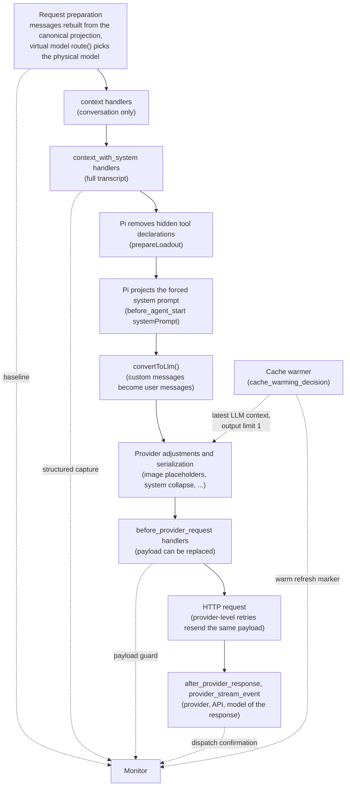

# Request-only context capture

Architecture note for the context-monitor Pi extension. Status: draft, revised 2026-10-02; open questions resolved against Pi 0.99.1 and rechecked against Pi 1.0.0 (source and fixture runs, see [Resolved questions](#resolved-questions)). Target: Pi 0.99.0 or later (core capture works from 0.87.0; see Version requirements).

## Purpose

This component detects and reports changes that other extensions make to an LLM request without persisting them in the session. It covers additions, modifications and deletions of conversation messages, system prompt content and tool declarations that exist only for a single request.

Persistent changes are deliberately out of scope. Pi records them in the session, so they are already part of the baseline this component diffs against and they cancel out of the result. What remains in the diff is, by construction, request-only.

"Other extensions" includes Pi's built-in features. Since 0.99, codemode, tool search, MCP and llama.cpp load as extensions named `builtin:<name>`, so their request-only changes are in scope exactly like a third-party extension's. Two request-only steps that Pi runs itself are also in scope, because they carry out an extension's choice: the forced system prompt and hidden tool declarations. Pi's adjustments for the physical model, such as image placeholders, are not extension changes and are normalized away.

## Scope

| Change made by another extension                                           | Mechanism                                                                                                                         | Persisted                                                                                                       | Handled here                                             |
| -------------------------------------------------------------------------- | --------------------------------------------------------------------------------------------------------------------------------- | --------------------------------------------------------------------------------------------------------------- | -------------------------------------------------------- |
| Transform the conversation for one request                                 | `context` handler                                                                                                                 | No                                                                                                              | Yes, structured                                          |
| Transform the full transcript, prompt or tool declarations for one request | `context_with_system` handler                                                                                                     | No                                                                                                              | Yes, structured or text-level (depends on load position) |
| Replace the serialized provider payload                                    | `before_provider_request` handler                                                                                                 | No                                                                                                              | Yes, text-level (depends on load position)               |
| Replace the whole system prompt for one run                                | `before_agent_start` returning `systemPrompt`, which sets `forceSystemPrompt`                                                     | No; Pi applies it to each request after the last `context_with_system` handler                                  | Yes, structured, any load position (D3)                  |
| Hide active tools' declarations from requests                              | `hiddenDeclarations` from an orchestrating tool's `prepareLoadout()`, used by `codemode`                                          | No; the transcript keeps the declarations and Pi removes them from each request                                 | Yes, tool-declaration channel (D7)                       |
| Rewrite tool descriptions                                                  | `descriptions` from `prepareLoadout()`, used by `codemode`                                                                        | Yes, as the tool declarations recorded in system messages                                                       | No, in baseline                                          |
| Inject a stored message                                                    | `pi.sendMessage()`, stored as a `custom_message` entry                                                                            | Yes                                                                                                             | No, in baseline                                          |
| Omit or replace an earlier message in future context                       | `context_edit` entry                                                                                                              | Yes                                                                                                             | No, in baseline                                          |
| Compaction or branch summary                                               | `compaction` / `branch_summary` entries                                                                                           | Yes                                                                                                             | No, in baseline                                          |
| Entries proposed at boundaries                                             | `turn_end` / `agent_before_settle` results                                                                                        | Yes                                                                                                             | No, in baseline                                          |
| Prompt sections, guidelines, active tools                                  | `systemPromptOptions`, `pi.setActiveTools()`, recorded as system-message deltas                                                   | Yes                                                                                                             | No, in baseline                                          |
| Tool result or finalized message replacement                               | `tool_result`, `message_end`                                                                                                      | Yes, as the stored message                                                                                      | No, in baseline                                          |
| Route a request to a physical model and thinking level                     | A virtual model's `route()`                                                                                                       | Yes: the dispatched model is recorded in the response's assistant message, router state on the session branch   | No; only used to parse and normalize the payload (D4)    |
| Run tools from inside a tool                                               | `ctx.executeTool()`                                                                                                               | Only as a bounded `nestedCalls` record on the calling tool's result; nested results reach only the calling tool | No, never enters the request directly                    |
| Make separate model calls                                                  | `ctx.modelRegistry.streamSimple()`, classifier calls from routers or codemode scripts, image generation (`generateImages()`, 1.0) | Separate requests, not part of the agent's context                                                              | No                                                       |

## Relevant part of Pi's request pipeline

For each LLM call in an agent run, Pi first prepares the request. It rebuilds the request messages from the session manager's canonical projection. When the selected model is a virtual model, it then calls `route()`, which picks the physical model and thinking level; if that model's context window is too small, Pi compacts here and rebuilds. Routing therefore happens before any context handler runs, but `ctx.model` in those handlers still names the selection.

Next come all `context` handlers. They see the conversation without system messages, and Pi restores its prompt and tool state after each one. If a handler changes the conversation, Pi restores that state as one leading system message replayed from all system messages, not as the original sequence. Then all `context_with_system` handlers run; they see the full transcript, including system messages, and can return a new one.

After the last `context_with_system` handler, Pi runs two request-only steps of its own. It removes the tool declarations that `prepareLoadout()` hooks hide (D7). When a `before_agent_start` handler returned `systemPrompt`, it replaces all system messages with one leading system message that holds the forced text and the current tools (D3). Pi then converts the transcript with `convertToLlm()`, where custom messages become plain user messages. The provider layer adjusts the messages for the physical model and serializes them (D4 lists the adjustments). Finally, all `before_provider_request` handlers run on the serialized payload and may replace it before the HTTP request goes out. Provider-level retries resend that payload without running the handlers again. On the response side, `after_provider_response` fires with the HTTP status, and `provider_stream_event` fires for each parsed provider event and names the provider, API and model that answered.

The cache warmer can send extra requests between or during runs. Each refresh fires `cache_warming_decision`, then serializes the LLM context of the latest request again with an output limit of one token. `before_provider_request`, `after_provider_response` and `provider_stream_event` fire for it, but no context event, `turn_start` or `message_end`.

Two ordering rules matter. Within one event, handlers run in extension order (D1), and each handler sees the output of the previous one. Across events, the sequence above is fixed and does not depend on load order; neither do Pi's own steps after `context_with_system`. The design relies on the second rule and avoids depending on the first.



## Design decisions

### D1. One extension, one entry point

An earlier design split the monitor into a "head" extension, loaded first to snapshot the `context` input, and a "tail", loaded last to capture the final transcript, with the two linked over `pi.events`. It was dropped because no extension can claim a global position. Handlers run in extension order and no priority option exists. The order depends on where an extension is configured, not on when its factory runs:

1. Command-line `-e` extensions, in the given order; `-e builtin:<name>` comes after the other command-line extensions.
2. Entries of the project `extensions` setting.
3. Extensions auto-discovered in the project's `.pi/extensions/`, in file-name order.
4. Entries of the personal `extensions` setting.
5. Extensions auto-discovered in the agent directory's `extensions/`, in file-name order.
6. Packages: project `packages` first, then personal `packages`, each in settings order.
7. Built-in extensions not loaded with `-e`: llama.cpp, codemode, tool-search, mcp.

Project resources load only after project trust is resolved, so their factories run after the personal and command-line ones, but their handlers still take the positions above. A package's extension files stay together in manifest order, so a head and tail shipped in one package would sit next to each other rather than at opposite ends. Neither 0.99 nor 1.0 adds a per-handler hook or an event that exposes the final request as Pi messages.

### D2. Baseline from the session projection

The baseline is `ctx.sessionManager.buildSessionProjection().messages`, read inside the capture handler. Since 0.87 this is Pi's canonical, edit-aware projection (it applies `context_edit` entries), and it is what Pi rebuilds each request from: request preparation sets the request messages to this projection, and the context chain starts from a deep copy of it. Because it contains every persistent contribution, the diff against it contains only request-only contributions. The projection also returns each message's source entry, which lets the UI label baseline messages by entry ID. Reading it does not depend on load order, which is what makes the head extension unnecessary.

With no other extensions, the projection read in `context_with_system` equals the captured transcript exactly, as JSON. This held for a first prompt, tool follow-ups, a later prompt, a session resumed in a new process with another model, a compaction checkpoint, and custom messages from `before_agent_start` and `deliverAs: "nextTurn"`.

### D3. Primary capture on `context_with_system`

The monitor's `context_with_system` handler clones `event.messages` with `structuredClone` and diffs it against the baseline. Because `context_with_system` runs after every `context` handler, this capture includes all `context` contributions regardless of where the monitor loads. It also includes `context_with_system` contributions from extensions loaded before the monitor. Message-level structure (roles, `customType`, `details`, system sections) is still intact at this stage, so this is where structured diffs and attribution happen.

Handlers of this event share one array: Pi passes the same `event.messages` object to the next handler, and a later handler that edits it in place also changes the messages the monitor has already seen. The clone must therefore be taken synchronously, before the handler returns.

The system messages in the capture may not match the baseline one-to-one. When any `context` handler changes the conversation, Pi replaces all system messages with one leading replayed system message. The differ therefore compares replayed system state rather than individual system messages (see Diff algorithm).

A forced system prompt is not in this capture. When a `before_agent_start` handler returns `systemPrompt`, Pi sets `forceSystemPrompt` for the run and applies it to each request after the last `context_with_system` handler, whatever the load order. All system messages then collapse into one leading system message with the forced text and the current tools, so section patches added by `context_with_system` handlers do not reach that request. The monitor detects the forced prompt in the same handler: `ctx.getSystemPrompt()` returns the forced text. In the checked runs it differed from the prompt replayed from the baseline (`getCurrentSystemPrompt(baseline)` from `@earendil-works/pi-ai`) only when a forced prompt was active, including after tool changes on a later prompt. The capture records that text, the differ reports it as a structured request-only change, and the payload guard applies the same projection before it compares.

### D4. Payload guard on `before_provider_request`

At this stage the payload is provider-specific JSON and custom messages have already become user messages, so a structural diff is impractical. The guard parses the payload into two channels and compares each with the same data extracted from the captured transcript, skipping `details` and other metadata that is never sent. The message channel holds model-facing text: message content and system text. Text only in the payload means something was added or changed after the capture; text only in the capture means something was removed. Either finding is reported as "edited after monitor", without structure or attribution. The tool-declaration channel holds tool names and descriptions; its differences first go through the loadout check in D7, and only unexplained ones are reported as "edited after monitor".

This covers `context_with_system` handlers loaded after the monitor, `before_provider_request` handlers loaded before it, and hidden tool declarations. Rewrites by `before_provider_request` handlers loaded after the monitor remain invisible.

#### Pairing payloads with captures

Each agent request fires `context_with_system` once and then `before_provider_request` once, so the guard pairs a payload with the latest unpaired capture. Retries keep this pairing intact:

- An agent-level retry (`retry.enabled`, on by default) starts a new run. `turn_start`, `route()` with reason `retry`, `context`, `context_with_system` and `before_provider_request` all fire again, even when the router switches to another model. The failed request fires neither `after_provider_response` nor `provider_stream_event` when the HTTP call fails; its assistant message, with `stopReason: "error"`, names the model.
- A provider-level retry (`retry.provider.maxRetries`, 0 by default) resends the same payload inside the provider call without firing `before_provider_request` again.

`turnIndex` restarts at 0 for every run, including retry runs, so it cannot identify a request. The monitor numbers captures itself.

Cache-warm refreshes are the one exception: they fire `before_provider_request` with no new capture. The guard marks a payload as a warm refresh when `cache_warming_decision` fired after the latest capture and the payload's output limit is one token. The decision event alone is not enough: handler results do not change `event.action`, so the monitor cannot see whether a later handler turned "stop" into "warm" or back. A warm refresh repeats the latest request, so the guard skips it instead of reporting the same findings again. It still consumes that refresh's `provider_stream_event`.

Compaction and branch summaries, calls through `ctx.modelRegistry` and router classifier calls do not fire `before_provider_request`.

#### Pi's own adjustments

Before comparing, the guard applies to the capture the steps that Pi runs after it, or accepts their results in the payload:

- Hidden tool declarations (D7) and the forced system prompt (D3).
- `convertToLlm()`: custom messages become user messages, bash executions and summaries get wrapper text, and bash executions excluded from context are dropped. With image blocking on, images become the text "Image reading is disabled."
- Models without image input, whether routed or selected, get "(image omitted: model does not support images)" instead of images, or the tool-result variant.
- Assistant messages from another model: thinking becomes plain text, empty and redacted thinking is dropped, thought signatures are removed and tool-call IDs may be rewritten.
- Assistant messages that ended with an error or were aborted are dropped. Tool calls without a result get a synthetic "No result provided" error result, and a system message between a tool call and its results moves after the results.
- Models without mid-conversation system message support (`compat.supportsMidConvoSystemMessages`, off by default in the checked APIs) get all system messages collapsed into one leading prompt, and the payload's tool list is the current tool set. A section patch appended after the user message ended up in the leading system prompt for both `openai-completions` and `anthropic-messages`. Models with support keep later system messages; with native mid-conversation tool changes, Anthropic payloads also declare a deferred `__pi_deferred_placeholder__` tool.

Pi exports helpers for part of this: `convertToLlm` from `@earendil-works/pi-coding-agent`, and `getCurrentSystemMessage`, `getCurrentSystemPrompt` and `resolveTranscript` from `@earendil-works/pi-ai`. The per-model message transforms are not exported, so the text extractors must reproduce them or tolerate them. The calibration run in Validation only triggers some of these adjustments; the rest need their own fixtures.

#### Payload format: two options

The guard needs the provider format of each payload. The `before_provider_request` event carries only the payload: Pi passes the model to its payload hook internally but does not put it on the event. `ctx.model` names the selection, not the physical model the router picked. The payload's own `model` field, where present, names the model ID but not the provider or API. This leaves two options; the choice is still open.

**Option A: parse after dispatch.** The guard keeps the payload clone until the response names the model: the first `provider_stream_event` gives provider, API and model; for a request that fails before streaming, the assistant message from `message_end` names them. The parser is then chosen by API, and `ctx.modelRegistry.find(provider, model)` returns the physical model with its `compat` and `input`.

- Pro: no guessing. The parser follows the real API, even where APIs share a shape; several APIs use a `messages` array, and both Responses-style APIs use `input`.
- Pro: exact normalization. System collapse and image placeholders depend on the physical model's `compat` and `input`, which a virtual model can change on every request.
- Pro: fits D5, which defers the work anyway.
- Con: findings wait for the first response event or the failure, that is, at least the time to first token.
- Con: the payload clone stays in memory until then, which matters for long conversations.
- Con: needs a fallback when no event arrives, for example a warm refresh that fails; the cache warmer ignores its own errors and fires no `message_end`.
- Con: depends on two more events, `provider_stream_event` and `message_end`, keeping their current behavior.

**Option B: shape detection.** The parser detects the format from the payload's shape, and the DispatchConfirmer uses `provider_stream_event` to check that choice after the fact.

- Pro: immediate and independent of the response; works for requests that never get one.
- Pro: simple, with no state kept between events.
- Con: shapes are shared between APIs, so the choice can be wrong, and a wrong choice is only flagged after the response starts.
- Con: the shape does not say which of Pi's adjustments the model got, so normalization must accept every variant. That can hide real edits; for example, an extension that removes images looks like Pi's image placeholder.

With either option, a single session can produce several formats when a virtual model routes between providers.

### D5. Observe only, stay off the critical path

Handlers never return a value, so the monitor never changes what is sent. Captures are cloned synchronously because later handlers may mutate the same objects (D3). Everything else (diffing, attribution, rendering) should be deferred, since these handlers sit on the request path and slow handlers delay the model call.

### D6. Attribution is best-effort

The extension API exposes no per-handler hook (checked in the 0.99.1 and 1.0.0 type declarations), so a diff says what changed but not who changed it. The attributor labels an added message with its `customType` when it is a custom message (`role: "custom"`) and marks everything else "unattributed". For modifications and deletions, `customType` identifies the owner of the affected message, not the extension that edited it.

`details` travels with custom messages but is never sent to the model, so cooperating extensions can put provenance there, for example `{ source, reason }`. `customType` itself is only a convention: nothing makes it unique, it is not tied to an extension file, and any extension can reuse another's value. It disappears during provider conversion, so attribution is only possible in the `context_with_system` stage. A stronger option is an opt-in protocol in which cooperating extensions announce their request-only edits over `pi.events`.

### D7. Tool declarations and loadouts

Since 0.99, a tool can define `prepareLoadout()`. Pi calls it whenever the active tools change. Its two results reach the request differently:

- `descriptions` replace the model-facing descriptions of declared tools. Pi applies them to the agent's tools, so the tool declarations recorded in system messages already carry them. They are part of the baseline and never show up in the diff.
- `hiddenDeclarations` names active tools whose declarations requests leave out, while the tools stay active and callable. The transcript still declares them, so the active set survives `/tree` and resume. Pi removes them from each request after the last `context_with_system` handler, whatever the load order. The built-in `codemode` hides the direct tools it can call when `"codemode": { "mode": "only" }` is set. Since 0.99.2, Pi also leaves hidden tools out of the system prompt's tool list; that list is a recorded prompt section, so this part is in the baseline.

So the only request-only loadout effect is a declaration that the capture has and the payload lacks. The monitor cannot read the hidden set: Pi keeps it internal, and `pi.getAllTools()` does not say which tools have a `prepareLoadout()` hook. It does report each tool's exposure and namespace, and the docs recommend `model-only` exposure for tools that orchestrate other tools. When declarations are missing from the payload and active `model-only` tools exist, the guard attributes the difference to those tools as candidates. Among the built-ins, `codemode` and `tool_search` are both `model-only`, but since 0.99.2 only `codemode` defines `prepareLoadout()`, so `tool_search` is always a false candidate. Added or rewritten declarations are never loadout effects and are reported as "edited after monitor".

### D8. Built-in features are ordinary extensions

Codemode, tool search, MCP and llama.cpp load as extensions named `builtin:<name>` since 0.99, and Pi's diagnostics use those names. They take the last positions in D1 unless loaded with `-e`. In 0.99.1 and 1.0.0 none of them registers a `context`, `context_with_system` or `before_provider_request` handler: MCP handles session events, `before_agent_start`, `turn_start`, `mcp_servers_change` and, since 0.99.2, `tool_call`, and llama.cpp registers a provider. MCP's `before_agent_start` handler waits for servers with `direct` tools and, since 0.99.2, writes the `mcp_servers` section to `systemPromptOptions`; Pi records a changed section in the session, so it is part of the baseline. Its `tool_call` handler only waits for the servers that a codemode script or `tool_search` needs. Their load position therefore does not matter here, and their only request-only change is codemode's hidden declarations, which Pi applies itself (D7). The monitor gives them no special treatment. `--no-extensions` disables them as well, which the calibration run in Validation relies on.

## Components

| Component         | Hook                                                                                        | Responsibility                                                                                                                  |
| ----------------- | ------------------------------------------------------------------------------------------- | ------------------------------------------------------------------------------------------------------------------------------- |
| RequestTracker    | `context_with_system`, `cache_warming_decision`, `before_provider_request`                  | Numbers captures, pairs each payload with its capture, and marks cache-warm refreshes (D4)                                      |
| ProjectionReader  | inside `context_with_system`                                                                | Reads baseline messages and their source entries from `ctx.sessionManager.buildSessionProjection()`                             |
| TranscriptCapture | `context_with_system`                                                                       | Clones `event.messages` and records the forced prompt, if `ctx.getSystemPrompt()` differs from the replayed baseline prompt     |
| Differ            | none (deferred)                                                                             | Compares replayed system state and aligns the other messages; emits additions, modifications and deletions                      |
| Attributor        | none (deferred)                                                                             | Labels changes using `customType` and `details`, otherwise "unattributed"                                                       |
| PayloadParser     | none (deferred)                                                                             | Chooses the provider format (D4, two options) and extracts the message channel and the tool-declaration channel                 |
| PayloadGuard      | none (deferred)                                                                             | Applies Pi's own adjustments to the capture, compares both channels with the payload, and emits "edited after monitor" findings |
| LoadoutAttributor | none (deferred)                                                                             | Explains declarations missing from the payload with active `model-only` tools reported by `pi.getAllTools()`                    |
| DispatchConfirmer | `provider_stream_event` (first event of each response), `message_end` (assistant, failures) | Records the provider, API and model that answered; with shape detection, flags a mismatch with the detected format              |
| Reporter          | none (deferred)                                                                             | Renders findings; kept independent of capture so non-interactive modes still work                                               |

`provider_stream_event` handlers are awaited in stream order, and slow handlers delay stream consumption. The DispatchConfirmer therefore records only the first event of each response and returns immediately. It treats `event.data` as read-only, because mutating it can affect Pi's normalization. A request whose HTTP call fails fires no `provider_stream_event`; its assistant message from `message_end` names the model instead.

The reporter guards terminal-only UI with `ctx.mode === "tui"` and uses `ctx.hasUI` for dialogs, since extensions also load in RPC, JSON and print modes. If findings should survive restarts, they can be stored with `pi.appendEntry()`, which persists data without adding it to model context, at the cost of larger session files.

## Diff algorithm

Request messages carry no stable IDs, and Pi may rewrite the sequence of system messages (D3), so the differ compares system state and conversation separately.

**System state.** Replay the system messages of each side with `getCurrentSystemMessage()` from `@earendil-works/pi-ai`. It appends plain `content`, patches named `sections` (`null` removes one) and applies `toolsRemoved` and `toolsAdded` in order. Compare the two results per section and per tool, so a changed prompt section or an added tool declaration is reported on its own. Replay makes a collapsed leading message equal to the sequence it replaced, so Pi's collapse after a changing `context` handler is not reported. Replay does lose where a system message sat among the other messages; report a position change separately if it matters. A forced prompt is compared from the text the capture recorded (D3), not from replay.

**Conversation.** Drop system messages on both sides. Each remaining message gets a key built from its role, its `customType` if present, and canonical JSON of its model-facing content, ignoring volatile metadata. The sequences are aligned with an LCS (Myers) diff over these keys. Unmatched capture entries are additions and unmatched baseline entries are deletions. A deletion and an addition with the same role at the same aligned position are reported together as a modification with a content-level diff, while a reordered message appears as a deletion plus an addition.

## Code skeleton

```ts
import type { ExtensionAPI, ExtensionContext } from "@earendil-works/pi-coding-agent";
// AgentMessage is not exported from the pi-coding-agent root
import type { AgentMessage } from "@earendil-works/pi-agent-core";
import { getCurrentSystemPrompt } from "@earendil-works/pi-ai";

interface Capture {
  id: number;
  messages: AgentMessage[];
  baseline: AgentMessage[];
  forcedPrompt?: string;
}

interface PendingPayload {
  capture?: Capture;
  payload: unknown;
  warmRefresh: boolean;
}

export default function contextMonitor(pi: ExtensionAPI) {
  let captureCount = 0;
  let unpaired: Capture | undefined; // latest capture still waiting for its payload
  let warmDecisionSinceCapture = false;
  let awaitingDispatch: PendingPayload | undefined;

  pi.on("context_with_system", (event, ctx) => {
    const baseline = ctx.sessionManager.buildSessionProjection().messages;
    const effectivePrompt = ctx.getSystemPrompt();
    const capture: Capture = {
      id: ++captureCount,
      // later handlers can edit these objects in place, so clone now
      messages: structuredClone(event.messages),
      baseline,
      forcedPrompt: effectivePrompt === getCurrentSystemPrompt(baseline) ? undefined : effectivePrompt,
    };
    unpaired = capture;
    warmDecisionSinceCapture = false;
    // observe only: defer the expensive work and return nothing
    setTimeout(() => report(ctx, capture.id, attribute(diff(capture))), 0);
  });

  pi.on("cache_warming_decision", () => {
    warmDecisionSinceCapture = true;
  });

  pi.on("before_provider_request", (event, ctx) => {
    const payload = structuredClone(event.payload);
    const warmRefresh = warmDecisionSinceCapture && hasOneTokenLimit(payload);
    if (awaitingDispatch) settle(ctx, awaitingDispatch, undefined); // no response event arrived
    awaitingDispatch = { capture: warmRefresh ? undefined : unpaired, payload, warmRefresh };
    if (!warmRefresh) unpaired = undefined;
  });

  pi.on("provider_stream_event", (event, ctx) => {
    // awaited in stream order: record the first event of each response and return
    if (!awaitingDispatch) return;
    settle(ctx, awaitingDispatch, { provider: event.provider, api: event.api, model: event.model });
    awaitingDispatch = undefined;
  });

  pi.on("message_end", (event, ctx) => {
    // a request that failed before streaming has no stream event; its assistant message names the model
    const message = event.message;
    if (message.role !== "assistant" || !awaitingDispatch) return;
    settle(ctx, awaitingDispatch, { provider: message.provider, api: message.api, model: message.model });
    awaitingDispatch = undefined;
  });

  function settle(ctx: ExtensionContext, pending: PendingPayload, dispatch: Dispatch | undefined) {
    // a warm refresh repeats the latest request
    if (pending.warmRefresh || !pending.capture) return;
    setTimeout(() => {
      const model = dispatch && ctx.modelRegistry.find(dispatch.provider, dispatch.model);
      const parsed = parsePayload(pending.payload, chooseFormat(pending.payload, dispatch));
      const expected = applyPiSteps(pending.capture, model);
      const findings = explainByLoadout(compare(parsed, expected), pi.getAllTools());
      reportLateEdits(ctx, pending.capture.id, findings, dispatch);
    }, 0);
  }
}
```

`diff`, `attribute`, `report`, `hasOneTokenLimit`, `chooseFormat`, `parsePayload`, `applyPiSteps`, `compare`, `explainByLoadout` and `reportLateEdits` implement the components above. `Dispatch` holds the provider, API and model that answered. `chooseFormat` follows the dispatched API under option A and the payload's shape under option B (D4). Under option B, the guard can also run directly in the `before_provider_request` handler, and the dispatch only confirms the format. `applyPiSteps` reproduces the steps from D4 that Pi runs after the capture: the forced prompt projection, `convertToLlm()`, and, when the physical model is known, its system collapse and image placeholders. Hidden declarations stay as captured, and `explainByLoadout` handles them. The parser needs one branch per provider format; payloads that use either a `messages` or an `input` array are both common, and with virtual models a single session can produce several formats.

## Package and installation

```json
{
  "name": "pi-context-monitor",
  "keywords": ["pi-package"],
  "pi": { "extensions": ["./src/index.ts"] },
  "peerDependencies": {
    "@earendil-works/pi-coding-agent": "*",
    "@earendil-works/pi-agent-core": "*",
    "@earendil-works/pi-ai": "*"
  }
}
```

The package name is a placeholder. Host-provided packages go in `peerDependencies` with a `"*"` range and never in `dependencies`, because a physical copy can bypass Pi's module mapping and Pi warns about it. Pi maps all three packages above for extensions; `@earendil-works/pi-ai` provides the transcript helpers used by the differ and the guard. Since 0.99, managed git packages also no longer install Pi peer dependencies automatically, and Pi warns about extension packages that list host-provided modules in `dependencies`. Users install with `pi install npm:pi-context-monitor` or `pi install git:github.com/<owner>/pi-context-monitor`.

A personal install is written to `~/.pi/agent/settings.json`. Adding `-l` writes it to `.pi/settings.json` instead. The install scope sets the monitor's position among handlers (D1). A later position is better: it moves more `context_with_system` handlers into the structured diff and more `before_provider_request` handlers into the payload guard's view. A personal package runs after every non-package extension and after all project packages, and the last entry of the personal `packages` list is the latest position a package can take. Only built-ins come after it, and they register no request-transform handlers. A project install runs earlier, before every personal package, even though project extensions are loaded later.

## Guarantees and blind spots

| Source of request-only change                                                       | How the monitor sees it                            | Attribution                             |
| ----------------------------------------------------------------------------------- | -------------------------------------------------- | --------------------------------------- |
| `context` handler, any load position                                                | Structured diff                                    | `customType` heuristic                  |
| `context_with_system` handler loaded before the monitor                             | Structured diff                                    | `customType` heuristic                  |
| `context_with_system` handler loaded after the monitor                              | Payload guard, text only                           | None                                    |
| `before_provider_request` handler loaded before the monitor                         | Payload guard, text only                           | None                                    |
| `before_provider_request` handler loaded after the monitor                          | Not visible                                        | None                                    |
| Forced system prompt from `before_agent_start`, any load position                   | Structured, through `ctx.getSystemPrompt()` (D3)   | None                                    |
| Hidden tool declarations from `prepareLoadout()`, any load position                 | Payload guard, tool-declaration channel            | Active `model-only` tools as candidates |
| Tool descriptions from `prepareLoadout()`                                           | Part of the baseline, not reported                 | Not applicable                          |
| Pi's own request adjustments, such as image placeholders or system message collapse | Normalized, not reported                           | Not applicable                          |
| Cache-warm refresh requests                                                         | Marked and skipped; they repeat the latest request | Not applicable                          |

Summarization requests for compaction and branch summaries are outside this component. `before_provider_request` does not fire for them (issue #9773; still true in 1.0.0), and they are not agent turns. The same applies to other side requests, such as `ctx.modelRegistry.streamSimple()` calls, classifier calls made by virtual-model routers and codemode scripts, or image generation through `generateImages()`; they are separate requests, not contributions to the agent's context.

## Validation

All runs can use a local mock provider instead of a real model, so they cost nothing and can be repeated. A small HTTP server answers OpenAI chat completions and Anthropic messages with streamed replies, logs each request body, returns a tool call on request, and returns HTTP 500 on demand. A temporary agent directory (`PI_CODING_AGENT_DIR`) registers it in `models.json` as two providers, one per API, plus a text-only model. RPC mode (`pi --mode rpc`) drives several prompts, `compact` and idle waits in one process.

Calibration comes first. Run the monitor alone with `pi --no-extensions -e ./src/index.ts` (short form `pi -ne -e ./src/index.ts`). Since 0.99 this also disables the built-in extensions, so the run is a core-only baseline. If your model comes from the llama.cpp provider, which is now a built-in extension too, add `-e builtin:llama.cpp`. With no other extensions, the structured diff must be empty for every request, and the payload guard must report nothing. Anything that appears in that run is a representation difference to normalize in the key function or the text extractors, not an extension contribution. Cover tool follow-ups, a second prompt, a resumed session and a compaction checkpoint.

Then use small fixture extensions: one that adds, modifies and deletes messages in `context`; one that patches a system section in `context_with_system` and edits a message in place; one that rewrites the payload in `before_provider_request`; one that returns `systemPrompt` in `before_agent_start`; and one that calls `pi.setActiveTools()` on a later prompt, so the transcript has more than one system message. Load each of them both before and after the monitor with command-line order, and check that every change lands in the expected row of the table above. For D1, load marker fixtures from every position (command line, project and personal settings entries, project and personal auto-discovery, project and personal packages) with a saved project-trust decision.

Repeat the runs with each built-in loaded explicitly: `-e builtin:codemode` with the `codemode` tool enabled through `--tools` or `"defaultTools": ["+codemode"]`, once with `"codemode": { "mode": "only" }`, then `-e builtin:tool-search` and `-e builtin:mcp`. MCP needs a configured server to do anything; a minimal stdio server with one tool in the agent directory's `mcp.json` is enough to produce the `mcp_servers` section. Add a virtual-model fixture whose `route()` alternates between providers with different payload formats, and one that routes an image prompt to a model without image support. These check format handling, dispatch confirmation and placeholder normalization. For retries, make the server fail once, first with default settings (agent-level retry) and then with `"retry": { "enabled": false, "provider": { "maxRetries": 2 } }`. For cache warming, give the mock model `"promptCache": { "short": 12 }`, set `"cacheWarming": "idle"`, and load a fixture that returns `{ action: "warm" }` from `cache_warming_decision`.

## Resolved questions

Checked against the Pi 0.99.1 package source and with the mock-provider runs described in Validation. Rechecked on 2026-10-02 against Pi 1.0.0: the 0.99.1 and 1.0.0 packages were compared file by file, and the runs below were repeated with the same results.

| Question                                                                                                                                                                                                                               | Answer                                                                                                                                                                                                                                                                                                                                                                                | Evidence                                                                                                                                                                                                                                                                                                                                 |
| -------------------------------------------------------------------------------------------------------------------------------------------------------------------------------------------------------------------------------------- | ------------------------------------------------------------------------------------------------------------------------------------------------------------------------------------------------------------------------------------------------------------------------------------------------------------------------------------------------------------------------------------- | ---------------------------------------------------------------------------------------------------------------------------------------------------------------------------------------------------------------------------------------------------------------------------------------------------------------------------------------- |
| Does a forced system prompt from `before_agent_start` appear in the `context_with_system` transcript, or only in the provider payload?                                                                                                 | Only in the payload. Pi applies it after the last `context_with_system` handler, whatever the load order, and drops section patches that those handlers added. In the handler, `ctx.getSystemPrompt()` returns the forced text; it differed from the replayed baseline prompt only when a forced prompt was active (D3).                                                              | `_installAgentForcedPromptProjection` in `agent-session.ts` wraps the extension context chain. Fixture loaded before and after the monitor: the capture held the structured sections, the payload's system text was the forced text.                                                                                                     |
| Does `buildSessionProjection().messages` match the pre-`context` request messages exactly, including shape, timestamps and compaction checkpoints?                                                                                     | Yes, exactly, as JSON (D2).                                                                                                                                                                                                                                                                                                                                                           | `_installAgentRequestProjection` sets the request messages to the projection, and `emitContext` starts from `structuredClone` of them. Runs: first prompt, tool follow-up, second prompt, resume in a new process with another model, after `compact`, persisted custom messages.                                                        |
| Can later handlers mutate objects the monitor has already seen?                                                                                                                                                                        | Yes. `context_with_system` handlers share one array and its message objects; the `before_provider_request` payload is passed on the same way. Clone synchronously (D3, D5).                                                                                                                                                                                                           | `emitContext` passes `currentMessages` to each handler without copying. A fixture after the monitor edited a message in place, and the monitor's saved reference changed.                                                                                                                                                                |
| How are extensions from different packages and directories ordered within the same scope?                                                                                                                                              | By configured position, not by load time: command line, project settings entries, project auto-discovery, personal settings entries, personal auto-discovery, packages (project, then personal), built-ins. Auto-discovered files follow file-name order; package files stay together in manifest order (D1). Project factories run after trust is resolved but keep these positions. | `resourcePrecedenceRank` in `package-manager.ts`; `loadFinalExtensionSet` in `resource-loader.ts` orders by resolved path. Marker fixtures in every position, with `--approve` and with a saved trust decision.                                                                                                                          |
| Does `before_provider_request` fire again on automatic retries without a new `context_with_system`, which would pair a payload with a stale capture? With virtual models, a retry can also switch to another model and payload format. | No. Agent-level retries start a new run and fire `context_with_system` again, also when the router switches model. Provider-level retries resend the same payload without firing it again. Cache-warm refreshes do fire `before_provider_request` without a capture, so the guard marks and skips them (D4).                                                                          | Server failing once: agent-level retry logged two full event sequences; provider-level retry logged two HTTP requests and one `before_provider_request`. Cache warming logged `cache_warming_decision` and `before_provider_request` with an output limit of 1, and no context events.                                                   |
| Is a `prepareLoadout()` result recorded in the transcript's tool changes, or applied only when the request is built?                                                                                                                   | Both, by part: `descriptions` are recorded (baseline), `hiddenDeclarations` are removed from each request after the last `context_with_system` handler (D7).                                                                                                                                                                                                                          | `_applyToolLoadout` and `_installHiddenDeclarationsProjection` in `agent-session.ts`. Codemode `on`: codemode's rewritten descriptions were in the projection. Codemode `only`: the capture declared `read`, `bash` and `codemode`, the payload only `codemode`; on 1.0.0 the recorded prompt tool list also left out `read` and `bash`. |
| Does `before_provider_request` expose the dispatched model in 0.99? The type checked for this note carries only `payload`.                                                                                                             | No. The event has only `type` and `payload`. Pi passes the model to its internal payload hook but does not put it on the event. `route()` runs before the context handlers, but `ctx.model` still names the selection. D4 lists the two ways to get the format.                                                                                                                       | `BeforeProviderRequestEvent` in `extensions/types.ts` and `transformProviderPayload` in `sdk.ts`. Event keys logged in every run; a router fixture logged `route()` before `context`.                                                                                                                                                    |
| Where do the built-in extensions sit in the load order?                                                                                                                                                                                | After all file and package extensions, in the order llama.cpp, codemode, tool-search, mcp. With `-e builtin:<name>`, at the end of the command-line group. None registers a request-transform handler, so their position does not matter here (D8).                                                                                                                                   | `resourcePrecedenceRank` and `builtInExtensions`; the handlers registered by the files under `dist/extensions/`.                                                                                                                                                                                                                         |
| Has a per-handler hook been added that would allow real attribution?                                                                                                                                                                   | No, not in 0.99.1 or 1.0.0. Recheck on each Pi upgrade (Version requirements).                                                                                                                                                                                                                                                                                                        | `ExtensionAPI.on` overloads in `extensions/types.ts`.                                                                                                                                                                                                                                                                                    |

## Version requirements

The full design targets Pi 0.99.0 or later. It was verified against 0.99.1 and rechecked against 1.0.0; 0.99.2 and 1.0.0 change nothing in the request pipeline it relies on, and their related changes are covered in D7 and D8. The core capture needs only 0.87.0: `context_with_system` was added in 0.87.0, and `buildSessionProjection()` is available on the read-only session manager from that release. The DispatchConfirmer needs `provider_stream_event`, added in 0.99.0, and the parts about virtual models, tool loadouts, built-in extensions and cache warming describe 0.99 behavior; on 0.87 to 0.98 they have nothing to act on. The design does not apply as written to versions before 0.87.0.

On each Pi upgrade, recheck `extensions/types.ts` for a per-handler hook or a model field on `before_provider_request`, the handler order in D1, and the list of Pi's own adjustments in D4.

## References

| Source                                                                                                                                  | Used for                                                                                                                                                                                                                          |
| --------------------------------------------------------------------------------------------------------------------------------------- | --------------------------------------------------------------------------------------------------------------------------------------------------------------------------------------------------------------------------------- |
| [Pi extensions guide](https://pi.dev/docs/latest/extensions)                                                                            | Handler order, `context` vs `context_with_system`, `before_agent_start` prompt behavior, `pi.events`, UI modes                                                                                                                    |
| [`extensions/types.ts`](https://github.com/earendil-works/pi/blob/main/packages/coding-agent/src/core/extensions/types.ts)              | Event shapes: `context`, `context_with_system`, `before_provider_request`, `provider_stream_event`, `cache_warming_decision`, boundary drafts; `ToolLoadoutChanges`                                                               |
| Pi 0.99.1 and 1.0.0 package source                                                                                                      | Resolved questions: `agent-session`, `sdk`, `extensions/runner`, `package-manager`, `resource-loader`, `cache-warmer` in pi-coding-agent; `agent-loop` in pi-agent-core; `utils/transcript` and `api/transform-messages` in pi-ai |
| [Session file format](https://pi.dev/docs/latest/session-format)                                                                        | Entry types, `customType`, `details`, `context_edit`, `fromHook`, projection and context building                                                                                                                                 |
| [Pi packages](https://pi.dev/docs/latest/packages)                                                                                      | Manifest, install scopes, `peerDependencies`                                                                                                                                                                                      |
| [Configuration](https://pi.dev/docs/latest/configuration)                                                                               | Project configuration loads after trust                                                                                                                                                                                           |
| Pi settings docs (`docs/settings.md`)                                                                                                   | `retry.*`, `cacheWarming`, `codemode.mode`                                                                                                                                                                                        |
| [Release v0.87.0](https://github.com/earendil-works/pi/releases/tag/v0.87.0)                                                            | `context_with_system`, context edits, `context` no longer sees system messages                                                                                                                                                    |
| [Release v0.99.0](https://github.com/earendil-works/pi/releases/tag/v0.99.0)                                                            | Built-in extensions, `--no-extensions` and `-e builtin:<name>`, virtual models, tool exposure, `provider_stream_event`, package warnings                                                                                          |
| [Release v0.99.2](https://github.com/earendil-works/pi/releases/tag/v0.99.2)                                                            | `tool_search` without `prepareLoadout()`, hidden tools left out of the prompt tool list, MCP `mcp_servers` prompt section                                                                                                         |
| [Release v1.0.0](https://github.com/earendil-works/pi/releases/tag/v1.0.0)                                                              | `generateImages()` side requests                                                                                                                                                                                                  |
| [Extensions guide at v0.99.0](https://github.com/earendil-works/pi/blob/v0.99.0/packages/coding-agent/docs/extensions.md#tool-exposure) | Tool exposure, `prepareLoadout()`, `pi.getAllTools()`, nested `ctx.executeTool()` calls, `provider_stream_event` handling rules                                                                                                   |
| [Virtual models](https://github.com/earendil-works/pi/blob/v0.99.0/packages/coding-agent/docs/virtual-models.md)                        | Selection vs. dispatch, `route()` reasons, router state, image placeholders                                                                                                                                                       |
| [Issue #9773](https://github.com/earendil-works/pi/issues/9773)                                                                         | `before_provider_request` not firing for summarization requests                                                                                                                                                                   |
| [perk PR #2484](https://github.com/mattgiles/perk/pull/2484)                                                                            | Third-party check of the 0.87.0 build: `buildSessionProjection` on the read-only session manager, requests rebuilt from the manager                                                                                               |
| [pi-rukas issue #708](https://github.com/trail-openers/pi-rukas/issues/708)                                                             | Custom messages converted to user messages for the model (checked through 0.84.4)                                                                                                                                                 |
