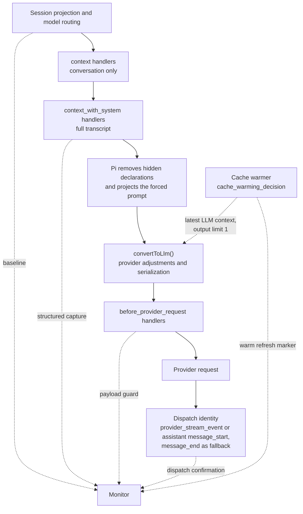

# Request-only context capture

Architecture for a request-only context monitor targeting the latest Pi release. This describes the intended design, not the current implementation of `pi-context-view`.

## Purpose and scope

Detect additions, modifications and deletions that extensions make to conversation messages, system prompt content and tool declarations for a request without persisting them in the session.

The baseline is Pi's canonical session projection. Persistent contributions are already in that baseline and cancel out of the diff. They include stored custom messages, `context_edit` entries, compaction and branch summaries, boundary entries, recorded prompt/tool changes, and finalized message or tool-result replacements.

Built-in extensions follow the same rules as third-party extensions. The forced system prompt and hidden tool declarations are also in scope: Pi applies these request-only changes on an extension's behalf. Pi's model-specific representation changes are normalized away.

| Request-only change                                                 | Capture                                     | Attribution                             |
| ------------------------------------------------------------------- | ------------------------------------------- | --------------------------------------- |
| `context` handler, any load position                                | Structured diff                             | `customType` heuristic                  |
| `context_with_system` handler before the monitor                    | Structured diff                             | `customType` heuristic                  |
| `context_with_system` handler after the monitor                     | Payload guard, text only                    | None                                    |
| `before_provider_request` handler before the monitor                | Payload guard, text only                    | None                                    |
| `before_provider_request` handler after the monitor                 | Not visible                                 | None                                    |
| Forced prompt from `before_agent_start`, any load position          | Structured, through `ctx.getSystemPrompt()` | None                                    |
| Hidden tool declarations from `prepareLoadout()`, any load position | Payload guard, tool-declaration channel     | Active `model-only` tools as candidates |
| Pi's model-specific adjustments                                     | Normalized, not reported                    | Not applicable                          |
| Cache-warm refresh                                                  | Marked and skipped                          | Not applicable                          |

Compaction and branch-summary requests, nested calls through `ctx.modelRegistry`, router classifier calls and image generation are separate requests, not contributions to the agent's context. They do not fire the agent's `before_provider_request` event. Nested tool results from `ctx.executeTool()` reach only the calling tool; they do not directly enter the request.

## Request pipeline

Pi rebuilds each request from the session projection. A virtual model's `route()` chooses the physical model before context handlers run, while `ctx.model` still names the selection. If the physical model requires compaction, Pi compacts and rebuilds before proceeding.



Within an event, handlers run in extension order and see previous handlers' results. Across preparation events, the sequence is fixed regardless of load order. The monitor relies on that separation, not on being first or last.

`context` excludes system messages. Pi restores its prompt and tool state after each handler; when a handler changes the conversation, that state becomes one leading replayed system message. `context_with_system` sees the full transcript and owns the result. Hidden declarations and the forced prompt are projected afterward, before conversion and serialization.

On the response side, `after_provider_response` reports HTTP status. Both `provider_stream_event` and assistant `message_start` identify the dispatched provider, API and model; their order depends on the adapter. Assistant `message_end` carries that identity too, including for failures. Cache warming fires provider events but no context, turn or assistant-message events.

## Design decisions

### D1. One extension, one entry point

No extension can claim a global handler position, and no priority option exists. Handlers follow configured resource order, not factory execution time:

1. Command-line `-e` extensions, in the given order; explicit `builtin:<name>` entries follow other command-line extensions.
2. Project `extensions` settings entries.
3. Project `.pi/extensions/` auto-discovery, in file-name order.
4. Personal `extensions` settings entries.
5. Agent-directory `extensions/` auto-discovery, in file-name order.
6. Packages: project, then personal, each in settings order; files within a package follow manifest order.
7. Remaining built-ins: llama.cpp, codemode, tool-search, mcp.

Project factories run after trust is resolved but retain these handler positions. For the latest package position, install personally and place the package last in the personal `packages` list. A later position widens capture coverage; it does not guarantee observation of every payload rewrite.

### D2. Baseline from the session projection

Read `ctx.sessionManager.buildSessionProjection().messages` inside the capture handler. This edit-aware projection is what Pi rebuilds each request from, and the context chain starts from a deep copy of it. It includes every persistent contribution without depending on the monitor's load position. The projection also supplies source entries for labeling baseline messages by entry ID.

With no request-only changes, the structured diff must be empty, including after tool follow-ups, resume and compaction.

### D3. Primary capture on `context_with_system`

Synchronously clone `event.messages` with `structuredClone`, then defer the diff. This captures all `context` contributions and earlier `context_with_system` contributions while roles, `customType`, `details` and system sections remain intact. Later handlers share the same message array and may mutate it in place, so retaining references is unsafe.

Compare replayed system state rather than individual system messages: Pi's collapse after a changing `context` handler must not appear as an extension edit.

A forced prompt is not in this capture. Detect it by comparing `ctx.getSystemPrompt()` with `getCurrentSystemPrompt(baseline)` from `@earendil-works/pi-ai`. Record the differing effective text as a structured request-only change. Pi projects that text after the final `context_with_system` handler, replacing all system messages with one leading message containing the forced text and current tools. Section patches in the captured transcript therefore do not reach that request. The payload guard must apply the same projection.

### D4. Payload guard on `before_provider_request`

Clone the payload synchronously, then parse and compare two channels off the critical path:

- **Messages:** model-facing message and system text, excluding `details` and other unsent metadata.
- **Tool declarations:** tool names and descriptions.

Compare them with the corresponding data extracted from the capture after Pi's adjustments. Unexplained additions, changes or removals are reported as **edited after monitor**, without structure or attribution. Missing declarations first go through the loadout check in D7. Later `before_provider_request` handlers remain invisible.

#### Request pairing

Number captures locally; `turnIndex` restarts at zero for every agent run and cannot identify a request. Pair each agent payload with its latest unpaired capture.

- An agent-level retry (`retry.enabled`) starts a new run, repeats routing and context capture, and can choose a different physical model. A failure before streaming still produces an assistant message naming the model.
- A provider-level retry (`retry.provider.maxRetries`) resends the same payload without repeating `before_provider_request`.
- A cache-warm refresh fires `before_provider_request` without a new capture. Mark it when `cache_warming_decision` occurred after the latest capture and the payload has a one-token output limit. Skip its comparison while consuming its provider events.

The cache-warming decision alone is insufficient: handler results do not update `event.action`, so the monitor cannot see whether a later handler changed it. Failed warm refreshes have no assistant-message fallback and do not need one because their comparison is skipped.

Release pending data on settlement and shutdown. Missing dispatch/model metadata or unsupported payload formats produce an incomplete guard result, not an empty diff.

#### Pi's own adjustments

Normalize these differences before reporting extension edits:

- Hidden declarations (D7) and forced prompt projection (D3).
- `convertToLlm()`: custom messages become user messages; bash executions and summaries get wrapper text; bash executions excluded from context are dropped. Image blocking replaces images with `Image reading is disabled.`
- Models without image input receive `(image omitted: model does not support images)` or the tool-result variant.
- Cross-model assistant replay can turn thinking into text, drop empty or redacted thinking, remove signatures and rewrite tool-call IDs.
- Error and aborted assistant messages are dropped. Tool calls without results receive synthetic `No result provided` error results. A system message between a tool call and its results moves after the results.
- Without `compat.supportsMidConvoSystemMessages`, system messages collapse into one leading prompt and declarations become the current tool set. With support, later system messages remain; Anthropic's native mid-conversation tool changes also declare `__pi_deferred_placeholder__`.

Use `convertToLlm` from `@earendil-works/pi-coding-agent` and the exported `getCurrentSystemMessage`, `getCurrentSystemPrompt` and `resolveTranscript` helpers from `@earendil-works/pi-ai`. Per-model message transforms are not exported; extractors must account for them without treating uncertain differences as proven Pi adjustments.

#### Payload format and dispatch metadata

Extraction and model-dependent normalization are separate problems. `before_provider_request` exposes only the payload, although the lower-level `onPayload(payload, model)` already receives the physical model. `transformProviderPayload` in `sdk.ts` drops that argument before calling the extension runner. A payload's `model` field does not identify its provider or API. `ctx.model` is useful for a stable physical selection, but is not universal dispatch evidence.

**Option A: parse after dispatch.** Keep the payload clone until assistant `message_start` or `provider_stream_event` supplies dispatch identity, whichever arrives first; use assistant `message_end` as fallback. Select a supported parser by API and obtain model capabilities through `ctx.modelRegistry.find(provider, model)`.

**Option B: shape detection.** Extract channels from a recognized payload representation without waiting for a response. APIs sharing that representation can share an extractor; exact API identification is unnecessary for extraction. Dispatch events later check extractor compatibility. Unknown or genuinely ambiguous shapes remain incomplete.

| Trade-off        | Option A                                                                | Option B                                                                                          |
| ---------------- | ----------------------------------------------------------------------- | ------------------------------------------------------------------------------------------------- |
| Format selection | Uses dispatch metadata                                                  | Uses supported payload shapes                                                                     |
| Normalization    | Model-aware if the catalog still describes the dispatched model         | Shape alone cannot establish model capabilities; defer dependent findings or mark them incomplete |
| Timing           | Waits for dispatch metadata or failure, not necessarily the first token | Extraction can finish before a response or without one                                            |
| Retention        | Keeps the payload clone until parsing                                   | Can release the clone after retaining comparison data                                             |
| State            | Capture pairing, dispatch confirmation and cleanup                      | Still needs pairing and confirmation; not stateless                                               |
| Main risk        | Missing events or model metadata                                        | Speculative extraction or overly broad normalization can hide real edits                          |

OpenAI Completions, OpenAI Responses and Anthropic emit their normalized assistant start after receiving the HTTP response, before consuming provider stream events. Other adapters differ; do not require either identity-bearing event to arrive first. Confirm only once per paired request, return immediately from stream handlers, and treat `event.data` as read-only.

**Hybrid:** extract unambiguous channels early, retain only comparison data, then normalize using dispatch metadata. This reduces raw-payload retention but adds logic; ambiguous formats still require deferred parsing or an incomplete result. All extraction remains deferred under D5.

A is the stronger correctness-first option on unmodified Pi; the hybrid can reduce its memory cost. B alone cannot promise exact model-dependent normalization. These remain alternatives, not a selected implementation strategy. A single session may use several formats through virtual routing.

The cleanest upstream improvement is to forward the full model into `before_provider_request`; it removes the metadata delay, but not the blind spot for later handlers. Cooperative announcements over `pi.events` require router/provider participation. Wrapping provider streaming can expose metadata immediately, but adds registration, reload and compatibility risks unsuitable as the default for an observe-only monitor.

### D5. Observe only, stay off the critical path

Handlers return no value and never mutate provider-bound data. Clone synchronously because later handlers may mutate shared objects; defer diffing, attribution, parsing and rendering. Awaited stream handlers must also return quickly.

Keep raw captures process-local. Never log them, persist extra copies, include them in notifications or inject them into later requests. Sanitize raw previews for the terminal and reveal them only after explicit user action.

### D6. Attribution is best-effort

Pi exposes no per-handler observation hook. Label added custom messages by `customType`; mark other changes unattributed. For modifications and deletions, `customType` identifies the affected message's owner, not its editor.

Cooperating extensions can put provenance such as `{ source, reason }` in `details`, which is not sent to the model, or announce edits over `pi.events`. Neither `customType` nor `details` proves ownership: any extension can reuse them. `customType` disappears during provider conversion, so this attribution is available only in structured capture.

### D7. Tool declarations and loadouts

Pi calls `prepareLoadout()` when active tools change. Its outputs have different persistence rules:

- `descriptions` replace tool descriptions and are recorded in system messages. They belong to the baseline.
- `hiddenDeclarations` removes declarations from each request after `context_with_system`, while tools stay active and callable. This is request-only. Hidden tools are also omitted from the recorded prompt's tool list; that prompt change belongs to the baseline.

Pi does not expose the hidden set or which tools define `prepareLoadout()`. `pi.getAllTools()` supplies exposure and namespace. When captured declarations are absent from the payload, active `model-only` tools are attribution candidates, not confirmed sources. Both built-in `codemode` and `tool_search` have that exposure, but only `codemode` defines `prepareLoadout()`, so `tool_search` is a false candidate. Added or rewritten declarations are not loadout effects.

### D8. Built-ins follow the same capture rules

Built-ins load as `builtin:<name>` at the positions in D1. Codemode, tool search, MCP and llama.cpp register no `context`, `context_with_system` or `before_provider_request` handlers. MCP writes its `mcp_servers` prompt section through `systemPromptOptions`, so it belongs to the baseline; llama.cpp registers a provider. Codemode's hidden declarations are handled through D7. No special capture path is needed.

## Components

| Component         | Hook                                                                        | Responsibility                                                                       |
| ----------------- | --------------------------------------------------------------------------- | ------------------------------------------------------------------------------------ |
| RequestTracker    | `context_with_system`, `cache_warming_decision`, `before_provider_request`  | Number captures, pair payloads, mark warm refreshes and manage pending-data cleanup  |
| ProjectionReader  | Inside `context_with_system`                                                | Read baseline messages and their source entries                                      |
| TranscriptCapture | `context_with_system`                                                       | Clone messages and record a forced prompt                                            |
| Differ            | Deferred                                                                    | Compare system state and align conversation messages                                 |
| Attributor        | Deferred                                                                    | Label changes from `customType` and cooperative provenance                           |
| PayloadParser     | Deferred                                                                    | Extract message and tool-declaration channels                                        |
| PayloadGuard      | Deferred                                                                    | Normalize Pi adjustments and report unexplained differences or incomplete comparison |
| LoadoutAttributor | Deferred                                                                    | Explain missing declarations with active `model-only` candidates                     |
| DispatchConfirmer | Assistant `message_start`, `provider_stream_event`, assistant `message_end` | Record identity once per paired request; check extractor compatibility under B       |
| Reporter          | Deferred                                                                    | Render findings independently of capture                                             |

Guard terminal-only reporting with `ctx.mode === "tui"` and dialogs with `ctx.hasUI`; capture must also work in RPC, JSON and print modes.

## Diff algorithm

Request messages have no stable IDs. Compare system state and conversation separately.

**System state.** Replay each side with `getCurrentSystemMessage()`: append plain `content`, patch named `sections` (`null` removes one), and apply `toolsRemoved` before `toolsAdded`. Compare sections and declarations separately. Replay makes Pi's collapsed leading system message equivalent to the sequence it replaced. It loses system-message placement; a position change needs a separate finding if relevant. Compare a forced prompt from its captured effective text, not replayed sections.

**Conversation.** Exclude system messages. Key each remaining message by role, `customType` when present, and canonical JSON of model-facing content, ignoring volatile metadata. Align the sequences with an LCS (Myers) diff. Unmatched capture messages are additions; unmatched baseline messages are deletions. Pair a deletion and addition with the same role at the same aligned position as a modification with a content-level diff. Reordering appears as deletion plus addition.

## Code skeleton

This illustrates option A, not a complete implementation. Unsupported formats or missing dispatch/model metadata produce incomplete results. Full tracker cleanup on settlement and shutdown is omitted.

The three imported Pi packages belong in `peerDependencies` with `"*"`, not `dependencies`: Pi supplies and maps them at runtime. A separate physical copy can bypass that mapping.

```ts
import type { ExtensionAPI, ExtensionContext } from "@earendil-works/pi-coding-agent";
// AgentMessage is not exported from the pi-coding-agent root
import type { AgentMessage } from "@earendil-works/pi-agent-core";
import { getCurrentSystemPrompt } from "@earendil-works/pi-ai";

interface Capture {
  id: number;
  messages: AgentMessage[];
  baseline: AgentMessage[];
  forcedPrompt?: string;
}

interface PendingPayload {
  capture?: Capture;
  payload: unknown;
  warmRefresh: boolean;
}

export default function contextMonitor(pi: ExtensionAPI) {
  let captureCount = 0;
  let unpaired: Capture | undefined; // latest capture still waiting for its payload
  let warmDecisionSinceCapture = false;
  let awaitingDispatch: PendingPayload | undefined;

  pi.on("context_with_system", (event, ctx) => {
    const baseline = ctx.sessionManager.buildSessionProjection().messages;
    const effectivePrompt = ctx.getSystemPrompt();
    const capture: Capture = {
      id: ++captureCount,
      // later handlers can edit these objects in place, so clone now
      messages: structuredClone(event.messages),
      baseline,
      forcedPrompt: effectivePrompt === getCurrentSystemPrompt(baseline) ? undefined : effectivePrompt,
    };
    unpaired = capture;
    warmDecisionSinceCapture = false;
    // observe only: defer the expensive work and return nothing
    setTimeout(() => report(ctx, capture.id, attribute(diff(capture))), 0);
  });

  pi.on("cache_warming_decision", () => {
    warmDecisionSinceCapture = true;
  });

  pi.on("before_provider_request", (event, ctx) => {
    const payload = structuredClone(event.payload);
    const warmRefresh = warmDecisionSinceCapture && hasOneTokenLimit(payload);
    if (awaitingDispatch) settle(ctx, awaitingDispatch, undefined); // no response event arrived
    awaitingDispatch = { capture: warmRefresh ? undefined : unpaired, payload, warmRefresh };
    if (!warmRefresh) unpaired = undefined;
  });

  pi.on("message_start", (event, ctx) => {
    // some adapters announce the assistant before consuming provider stream events
    const message = event.message;
    if (message.role !== "assistant" || !awaitingDispatch) return;
    settle(ctx, awaitingDispatch, { provider: message.provider, api: message.api, model: message.model });
    awaitingDispatch = undefined;
  });

  pi.on("provider_stream_event", (event, ctx) => {
    // awaited in stream order: confirm only if no earlier event supplied the identity
    if (!awaitingDispatch) return;
    settle(ctx, awaitingDispatch, { provider: event.provider, api: event.api, model: event.model });
    awaitingDispatch = undefined;
  });

  pi.on("message_end", (event, ctx) => {
    // fallback when neither earlier event confirmed the request
    const message = event.message;
    if (message.role !== "assistant" || !awaitingDispatch) return;
    settle(ctx, awaitingDispatch, { provider: message.provider, api: message.api, model: message.model });
    awaitingDispatch = undefined;
  });

  function settle(ctx: ExtensionContext, pending: PendingPayload, dispatch: Dispatch | undefined) {
    // a warm refresh repeats the latest request
    if (pending.warmRefresh || !pending.capture) return;
    setTimeout(() => {
      const model = dispatch && ctx.modelRegistry.find(dispatch.provider, dispatch.model);
      const format = dispatch && chooseFormat(pending.payload, dispatch);
      if (!model || !format) {
        reportIncompleteGuard(ctx, pending.capture.id);
        return;
      }
      const parsed = parsePayload(pending.payload, format);
      const expected = applyPiSteps(pending.capture, model);
      const findings = explainByLoadout(compare(parsed, expected), pi.getAllTools());
      reportLateEdits(ctx, pending.capture.id, findings, dispatch);
    }, 0);
  }
}
```

The omitted helpers implement the components above. `Dispatch` holds provider, API and model. `chooseFormat` returns no format for unsupported payloads. `reportIncompleteGuard` distinguishes an unavailable comparison from a successful comparison with no edits. `applyPiSteps` leaves hidden declarations in the expected channel for `explainByLoadout` to handle.

Under B or the hybrid, schedule extraction after the payload clone instead of waiting for dispatch; retain the comparison data needed for confirmation and normalization.

## Validation

Use synthetic fixtures with a local mock provider, an isolated `PI_CODING_AGENT_DIR` and RPC mode. The server should support OpenAI Completions and Anthropic streaming, tool calls, delayed stream events and controlled failures. Include a text-only model.

| Check                     | Required cases                                                                                                                                                                                                                                |
| ------------------------- | --------------------------------------------------------------------------------------------------------------------------------------------------------------------------------------------------------------------------------------------- |
| Core calibration          | Load only the monitor with `pi --no-extensions -e ./src/index.ts`. Both diffs must be empty for first and later prompts, tool follow-ups, resume with another model, and compaction. Add `-e builtin:llama.cpp` only if the model needs it.   |
| Handler ordering          | Load each fixture before and after the monitor. Exercise every resource position in D1 with project trust resolved.                                                                                                                           |
| Structured edits          | Add, modify and delete conversation messages; patch system sections; mutate messages in place; change active tools on a later prompt.                                                                                                         |
| Late edits                | Rewrite the payload before and after the monitor and confirm the stated visibility limits.                                                                                                                                                    |
| Forced prompt             | Return `systemPrompt` from `before_agent_start`; verify the capture and guard apply it regardless of load order.                                                                                                                              |
| Built-ins                 | Load codemode with an active `codemode` tool in both normal and `"codemode": { "mode": "only" }` settings; load tool-search and MCP with a minimal direct-tool server. Separate recorded prompt/description changes from hidden declarations. |
| Routing and normalization | Alternate physical providers; route image input to a text-only model; cover every adjustment in D4.                                                                                                                                           |
| Retries                   | Fail once with agent retries enabled, then with `"retry": { "enabled": false, "provider": { "maxRetries": 2 } }`. Verify capture pairing.                                                                                                     |
| Cache warming             | Set model `"promptCache": { "short": 12 }`, `"cacheWarming": "idle"`, and return `{ action: "warm" }` from the decision fixture. Check successful and failed refreshes are skipped.                                                           |
| Dispatch timing           | Delay stream events after HTTP headers; accept whichever identity-bearing event arrives first. Later events must not repeat findings. Include failures before streaming.                                                                      |
| Incomplete comparison     | Missing model metadata and unsupported or ambiguous payloads must not appear as empty diffs.                                                                                                                                                  |
| Shape extraction          | For B or the hybrid, share extractors only for equivalent representations. Do not accept an image placeholder as Pi's adjustment without model evidence.                                                                                      |
| Cleanup and privacy       | Release pending data on settlement/shutdown; keep raw content out of logs, session entries and notifications.                                                                                                                                 |

On Pi upgrades, recheck event shapes, handler order, provider adjustments and whether dispatch metadata is now exposed directly.

## References

- [Extensions](https://pi.dev/docs/latest/extensions) and [event types](https://github.com/earendil-works/pi/blob/main/packages/coding-agent/src/core/extensions/types.ts): lifecycle and extension contracts.
- [Session format](https://pi.dev/docs/latest/session-format): persistent entries and projection.
- [Virtual models](https://github.com/earendil-works/pi/blob/main/packages/coding-agent/docs/virtual-models.md): selection, dispatch and routing.
- [Pi packages](https://pi.dev/docs/latest/packages), [configuration](https://pi.dev/docs/latest/configuration) and [settings](https://github.com/earendil-works/pi/blob/main/packages/coding-agent/docs/settings.md): loading, dependencies, retries and warming.
- Pi source: [`coding-agent/src/core`](https://github.com/earendil-works/pi/tree/main/packages/coding-agent/src/core) for projection, extension dispatch and cache warming; [`agent-loop.ts`](https://github.com/earendil-works/pi/blob/main/packages/agent/src/agent-loop.ts) for assistant-message events; [`ai/src`](https://github.com/earendil-works/pi/tree/main/packages/ai/src) for transcript helpers, provider hooks and serialization.
