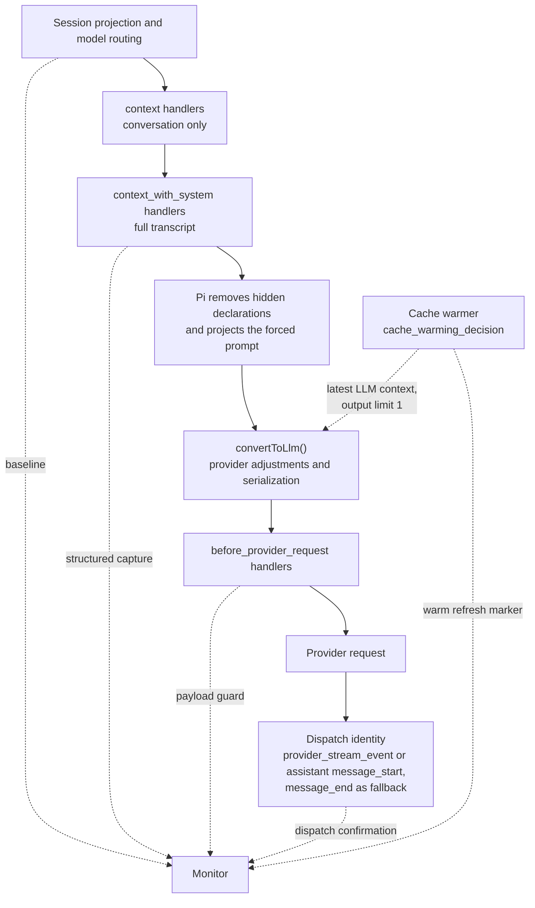
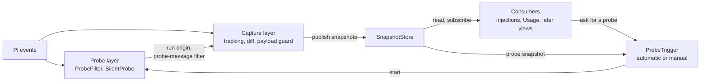

# Request-only context capture

Architecture for a request-only context monitor targeting the latest Pi release. This describes the intended design, not the current implementation of `pi-context-view`. The current silent probe is described in [ARCHITECTURE.md](ARCHITECTURE.md#on-demand-silent-probe); D10 lists what changes for it here.

## Purpose and scope

Detect additions, modifications and deletions that extensions make to conversation messages, system prompt content and tool declarations for a request without persisting them in the session.

Capture observes every agent request: user prompts, tool follow-ups, runs started by other extensions and [silent probe](#d10-silent-probe-is-a-trigger-not-a-capture-path) runs. Each capture becomes a request snapshot. Views and other consumers read snapshots; capture does not depend on any of them (D11).

The baseline is Pi's canonical session projection. Persistent contributions are already in that baseline and cancel out of the diff. They include stored custom messages, `context_edit` entries, compaction and branch summaries, boundary entries, recorded prompt/tool changes, and finalized message or tool-result replacements.

Built-in extensions follow the same rules as third-party extensions. The forced system prompt and hidden tool declarations are also in scope: Pi applies these request-only changes on an extension's behalf. Pi's model-specific representation changes are normalized away. Snapshots also record which tools the payload declares, so consumers can leave out hidden tools (D9).

| Request-only change                                                 | Capture                                     | Attribution                             |
| ------------------------------------------------------------------- | ------------------------------------------- | --------------------------------------- |
| `context` handler, any load position                                | Structured diff                             | `customType` heuristic                  |
| `context_with_system` handler before the monitor                    | Structured diff                             | `customType` heuristic                  |
| `context_with_system` handler after the monitor                     | Payload guard, text only                    | None                                    |
| `before_provider_request` handler before the monitor                | Payload guard, text only                    | None                                    |
| `before_provider_request` handler after the monitor                 | Not visible                                 | None                                    |
| Forced prompt from `before_agent_start`, any load position          | Structured, through `ctx.getSystemPrompt()` | None                                    |
| Hidden tool declarations from `prepareLoadout()`, any load position | Payload guard, tool-declaration channel     | Active `model-only` tools as candidates |
| Pi's model-specific adjustments                                     | Normalized, not reported                    | Not applicable                          |
| Cache-warm refresh                                                  | Marked and skipped                          | Not applicable                          |
| The monitor's own probe-message filter                              | Applied to both sides, not reported         | Not applicable                          |

Compaction and branch-summary requests, nested calls through `ctx.modelRegistry`, router classifier calls and image generation are separate requests, not contributions to the agent's context. They do not fire the agent's `before_provider_request` event. Nested tool results from `ctx.executeTool()` reach only the calling tool; they do not directly enter the request.

## Request pipeline

Pi rebuilds each request from the session projection. A virtual model's `route()` chooses the physical model before context handlers run, while `ctx.model` still names the selection. If the physical model requires compaction, Pi compacts and rebuilds before proceeding.



Within an event, handlers run in extension order and see previous handlers' results. Across preparation events, the sequence is fixed regardless of load order. The monitor relies on that separation, not on being first or last.

`context` excludes system messages. Pi restores its prompt and tool state after each handler; when a handler changes the conversation, that state becomes one leading replayed system message. `context_with_system` sees the full transcript and owns the result. Hidden declarations and the forced prompt are projected afterward, before conversion and serialization.

On the response side, `after_provider_response` reports HTTP status. Both `provider_stream_event` and assistant `message_start` identify the dispatched provider, API and model; their order depends on the adapter. Assistant `message_end` carries that identity too, including for failures. Cache warming fires provider events but no context, turn or assistant-message events.

A silent probe run follows the same pipeline. It aborts at `turn_start`, but Pi checks the abort signal only when the provider sends the HTTP request. Preparation, serialization and, on built-in adapters, `before_provider_request` therefore still run; no HTTP request is sent (D10).

## Module layers

Capture is split into layers with one-way dependencies. Consumers can move from a frozen first snapshot to a snapshot for every request without changes to capture, and probing can change from automatic to manual without changes to capture or the probe run itself.



| Layer         | Depends on                        | Must not depend on                 |
| ------------- | --------------------------------- | ---------------------------------- |
| Probe         | Pi events                         | Capture, store, trigger, consumers |
| Capture       | Pi events, probe interface, store | Trigger policy, consumers          |
| SnapshotStore | Snapshot types                    | Pi, probe, capture, consumers      |
| ProbeTrigger  | SilentProbe, store                | Capture internals, consumers       |
| Consumers     | Store, optionally ProbeTrigger    | Capture and probe internals        |

- **Probe interface.** Capture needs two things from the probe layer: whether SilentProbe owns the current run, and the probe-message filter. Without SilentProbe, no run is a probe run, but ProbeFilter stays active: sessions keep probe messages from earlier runtimes.
- **Run modes.** Capture, the probe layer and the store work in every run mode and without any consumer. Consumers and ProbeTrigger apply their own mode guards.
- **Wiring.** `src/index.ts` only registers the layers on Pi events and commands. Registration order matters once: ProbeFilter's `context_with_system` handler must come before capture's.

## Design decisions

### D1. One extension, one entry point

No extension can claim a global handler position, and no priority option exists. Handlers follow configured resource order, not factory execution time:

1. Command-line `-e` extensions, in the given order; explicit `builtin:<name>` entries follow other command-line extensions.
2. Project `extensions` settings entries.
3. Project `.pi/extensions/` auto-discovery, in file-name order.
4. Personal `extensions` settings entries.
5. Agent-directory `extensions/` auto-discovery, in file-name order.
6. Packages: project, then personal, each in settings order; files within a package follow manifest order.
7. Remaining built-ins: llama.cpp, codemode, tool-search, mcp.

Project factories run after trust is resolved but retain these handler positions. For the latest package position, install personally and place the package last in the personal `packages` list. A later position widens capture coverage; it does not guarantee observation of every payload rewrite.

The position also bounds the silent probe. Its `input` reset undoes only transforms from earlier extensions ([ARCHITECTURE.md](ARCHITECTURE.md#identifying-the-probe-run)), and ProbeFilter hides probe messages only from later handlers (D10).

### D2. Baseline from the session projection

Read `ctx.sessionManager.buildSessionProjection().messages` inside the capture handler. This edit-aware projection is what Pi rebuilds each request from, and the context chain starts from a deep copy of it. It includes every persistent contribution without depending on the monitor's load position. The projection also supplies source entries for labeling baseline messages by entry ID.

Remove recorded probe messages from the baseline with the same filter that ProbeFilter applies to the request (D10). Record the session leaf ID with the capture: consumers can rebuild this baseline later instead of the snapshot retaining it (D11).

With no request-only changes, the structured diff must be empty, including after tool follow-ups, resume, compaction and silent probes.

### D3. Primary capture on `context_with_system`

Synchronously clone `event.messages` with `structuredClone`, then defer the diff. The capture handler runs after ProbeFilter's handler, so the clone never contains probe messages. This captures all `context` contributions and earlier `context_with_system` contributions while roles, `customType`, `details` and system sections remain intact. Later handlers share the same message array and may mutate it in place, so retaining references is unsafe.

Compare replayed system state rather than individual system messages: Pi's collapse after a changing `context` handler must not appear as an extension edit.

A forced prompt is not in this capture. Detect it by comparing `ctx.getSystemPrompt()` with `getCurrentSystemPrompt(baseline)` from `@earendil-works/pi-ai`. Record the differing effective text as a structured request-only change. Pi projects that text after the final `context_with_system` handler, replacing all system messages with one leading message containing the forced text and current tools. Section patches in the captured transcript therefore do not reach that request. The payload guard must apply the same projection. Pi keeps the run's prompt options until the run settles, so this detection also works in probe runs.

### D4. Payload guard on `before_provider_request`

Clone the payload synchronously, then parse and compare two channels off the critical path:

- **Messages:** model-facing message and system text, excluding `details` and other unsent metadata.
- **Tool declarations:** tool names and descriptions.

Compare them with the corresponding data extracted from the capture after Pi's adjustments. Unexplained additions, changes or removals are reported as **edited after monitor**, without structure or attribution. Missing declarations first go through the loadout check in D7. Later `before_provider_request` handlers remain invisible.

#### Request pairing

Number captures locally; `turnIndex` restarts at zero for every agent run and cannot identify a request. Record each capture's origin: `synthetic-probe` while SilentProbe owns the current run, otherwise `real-turn`. Pair each agent payload with its latest unpaired capture.

- An agent-level retry (`retry.enabled`) starts a new run, repeats routing and context capture, and can choose a different physical model. A failure before streaming still produces an assistant message naming the model.
- A provider-level retry (`retry.provider.maxRetries`) resends the same payload without repeating `before_provider_request`.
- A cache-warm refresh fires `before_provider_request` without a new capture. Mark it when `cache_warming_decision` occurred after the latest capture and the payload has a one-token output limit. Skip its comparison while consuming its provider events.
- A capture can end without a payload, for example when a provider does not call `onPayload` or a probe run's authentication fails on the aborted signal (D10). A new capture or the run's `agent_settled` settles a capture that is still unpaired as incomplete.

The cache-warming decision alone is insufficient: handler results do not update `event.action`, so the monitor cannot see whether a later handler changed it. Failed warm refreshes have no assistant-message fallback and do not need one because their comparison is skipped.

Release pending data on settlement and shutdown. Missing dispatch/model metadata or unsupported payload formats produce an incomplete guard result, not an empty diff.

#### Pi's own adjustments

Pi changes the request after the capture. None of these changes are **edited after monitor** findings. Hidden declarations and the forced prompt projection are request-only changes that Pi makes on an extension's behalf; report them through D7 and D3. Normalize the other changes without reporting them:

- `convertToLlm()`: custom messages become user messages; bash executions and summaries get wrapper text; bash executions excluded from context are dropped. Image blocking replaces images with `Image reading is disabled.`
- Models without image input receive `(image omitted: model does not support images)` or the tool-result variant.
- Cross-model assistant replay can turn thinking into text, drop empty or redacted thinking, remove signatures and rewrite tool-call IDs.
- Error and aborted assistant messages are dropped. Tool calls without results receive synthetic `No result provided` error results. A system message between a tool call and its results moves after the results.
- Without `compat.supportsMidConvoSystemMessages`, system messages collapse into one leading prompt and declarations become the current tool set. With support, later system messages remain; Anthropic's native mid-conversation tool changes also declare `__pi_deferred_placeholder__`.

Use `convertToLlm` from `@earendil-works/pi-coding-agent` and the exported `getCurrentSystemMessage`, `getCurrentSystemPrompt` and `resolveTranscript` helpers from `@earendil-works/pi-ai`. Per-model message transforms are not exported; extractors must account for them without treating uncertain differences as proven Pi adjustments.

#### Payload format and dispatch metadata

Extraction and model-dependent normalization are separate problems. `before_provider_request` exposes only the payload, although the lower-level `onPayload(payload, model)` already receives the physical model. `transformProviderPayload` in `sdk.ts` drops that argument before calling the extension runner. A payload's `model` field does not identify its provider or API. `ctx.model` is useful for a stable physical selection, but is not universal dispatch evidence.

**Option A: parse after dispatch.** Keep the payload clone until assistant `message_start` or `provider_stream_event` supplies dispatch identity, whichever arrives first; use assistant `message_end` as fallback. Select a supported parser by API and obtain model capabilities through `ctx.modelRegistry.find(provider, model)`.

**Option B: shape detection.** Extract channels from a recognized payload representation without waiting for a response. APIs sharing that representation can share an extractor; exact API identification is unnecessary for extraction. Dispatch events later check extractor compatibility. Unknown or genuinely ambiguous shapes remain incomplete.

| Trade-off        | Option A                                                                | Option B                                                                                          |
| ---------------- | ----------------------------------------------------------------------- | ------------------------------------------------------------------------------------------------- |
| Format selection | Uses dispatch metadata                                                  | Uses supported payload shapes                                                                     |
| Normalization    | Model-aware if the catalog still describes the dispatched model         | Shape alone cannot establish model capabilities; defer dependent findings or mark them incomplete |
| Timing           | Waits for dispatch metadata or failure, not necessarily the first token | Extraction can finish before a response or without one                                            |
| Retention        | Keeps the payload clone until parsing                                   | Can release the clone after retaining comparison data                                             |
| State            | Capture pairing, dispatch confirmation and cleanup                      | Still needs pairing and confirmation; not stateless                                               |
| Main risk        | Missing events or model metadata                                        | Speculative extraction or overly broad normalization can hide real edits                          |

OpenAI Completions, OpenAI Responses and Anthropic emit their normalized assistant start after receiving the HTTP response, before consuming provider stream events. Other adapters differ; do not require either identity-bearing event to arrive first. Confirm only once per paired request, return immediately from stream handlers, and treat `event.data` as read-only. A probe run's aborted request has only the assistant events, and both carry the identity.

**Hybrid:** extract unambiguous channels early, retain only comparison data, then normalize using dispatch metadata. This reduces raw-payload retention but adds logic; ambiguous formats still require deferred parsing or an incomplete result. All extraction remains deferred under D5.

A is the stronger correctness-first option on unmodified Pi; the hybrid can reduce its memory cost. B alone cannot promise exact model-dependent normalization. These remain alternatives, not a selected implementation strategy. A single session may use several formats through virtual routing.

The cleanest upstream improvement is to forward the full model into `before_provider_request`; it removes the metadata delay, but not the blind spot for later handlers. Cooperative announcements over `pi.events` require router/provider participation. Wrapping provider streaming can expose metadata immediately, but adds registration, reload and compatibility risks unsuitable as the default for an observe-only monitor.

### D5. Observe only, stay off the critical path

Capture handlers return no value and never mutate provider-bound data. Clone synchronously because later handlers may mutate shared objects; defer diffing, attribution, parsing and snapshot assembly. Awaited stream handlers must also return quickly.

Only the probe layer changes requests, and only within fixed limits: ProbeFilter removes recorded probe messages from every request, and SilentProbe changes only the run it owns (D10).

Keep raw captures and snapshots process-local. Never log them, persist extra copies, include them in notifications or inject them into later requests. Consumers sanitize raw previews for the terminal and reveal them only after explicit user action. The probe persists only role-and-timestamp identities.

### D6. Attribution is best-effort

Pi exposes no per-handler observation hook. Label added custom messages by `customType`; mark other changes unattributed. For modifications and deletions, `customType` identifies the affected message's owner, not its editor.

Cooperating extensions can put provenance such as `{ source, reason }` in `details`, which is not sent to the model, or announce edits over `pi.events`. Neither `customType` nor `details` proves ownership: any extension can reuse them. `customType` disappears during provider conversion, so this attribution is available only in structured capture.

### D7. Tool declarations and loadouts

Pi calls `prepareLoadout()` when active tools change. Its outputs have different persistence rules:

- `descriptions` replace tool descriptions and are recorded in system messages. They belong to the baseline.
- `hiddenDeclarations` removes declarations from each request after `context_with_system`, while tools stay active and callable. This is request-only. Hidden tools are also omitted from the recorded prompt's tool list; that prompt change belongs to the baseline.

Pi does not expose the hidden set or which tools define `prepareLoadout()`. `pi.getAllTools()` supplies exposure and namespace. When captured declarations are absent from the payload, active `model-only` tools are attribution candidates, not confirmed sources. Both built-in `codemode` and `tool_search` have that exposure, but only `codemode` defines `prepareLoadout()`, so `tool_search` is a false candidate. Added or rewritten declarations are not loadout effects.

Snapshots report hidden declarations with these candidates. Each consumer decides how to present or count them (D11).

### D8. Built-ins follow the same capture rules

Built-ins load as `builtin:<name>` at the positions in D1. Codemode, tool search, MCP and llama.cpp register no `context`, `context_with_system` or `before_provider_request` handlers. MCP writes its `mcp_servers` prompt section through `systemPromptOptions`, so it belongs to the baseline; llama.cpp registers a provider. Codemode's hidden declarations are handled through D7 and D9. No special capture path is needed.

### D9. Declared tool names

Tool declarations replayed from the session projection include hidden tools: they stay active, so the replay still declares them, although the model never receives them. Each snapshot therefore records two name sets from its paired payload:

- **Declared:** names in the payload's tool-declaration channel, without `__pi_deferred_placeholder__`.
- **Baseline:** names replayed from the capture's baseline (D2).

Record them only when the tool-declaration channel is complete; the message channel does not matter. Warm refreshes record nothing. Retain only the two name sets and release the payload clone as D4 describes. Consumers decide how to use them; Usage's rules are in D11.

### D10. Silent probe is a trigger, not a capture path

A silent probe starts an agent run so that capture can observe request preparation before the user sends a prompt. Capture handles probe runs with the same handlers as other runs; only the snapshot origin differs. Whether a probe starts automatically or manually is trigger policy, which capture never sees.

The probe layer has three parts:

- **ProbeFilter** removes recorded probe messages from every request and from the capture baseline. It stays active even when probing is off, because sessions keep probe messages from earlier runtimes.
- **SilentProbe** runs one probe. Its lifecycle, run identification by token, message blanking, persisted identities and the [nested-send limitation](ARCHITECTURE.md#known-limitation-nested-sends) stay as in [ARCHITECTURE.md](ARCHITECTURE.md#on-demand-silent-probe), except for the filter placement below.
- **ProbeTrigger** decides when to probe:
  - **Automatic:** when a consumer needs a snapshot and the store has none. At most one attempt per extension runtime, as today.
  - **Manual:** an explicit user action. One probe at a time; concurrent requests share it. Every probe leaves blank entries in the session tree and runs other extensions' handlers, so never repeat probes without a user action.

Both policies wait for idle and return the consumer's fallback without probing while compaction is active ([ARCHITECTURE.md](ARCHITECTURE.md#compaction-failures-and-fallback)) or while Pi's reported context usage already exceeds the auto-compaction threshold (see [side effects](#side-effects)). ProbeTrigger resolves when the first `synthetic-probe` snapshot published after the start has a settled guard, or with the probe's failure reason. Probes run one at a time, so that snapshot belongs to this probe.

#### What a probe run reaches

SilentProbe aborts at `turn_start`. Pi checks the abort signal only in the provider's HTTP call, so the run still:

- prepares the request: routing, compaction checks, `context` and `context_with_system` handlers, hidden declarations, the forced prompt projection and `convertToLlm()`;
- on built-in adapters, serializes the payload and runs `before_provider_headers` and `before_provider_request` handlers;
- ends with an assistant error or aborted message naming the physical provider, API and model. `after_provider_response` and `provider_stream_event` do not fire.

A probe therefore gets a full structured capture (D3) and usually a payload. RequestTracker pairs the payload by the normal rule, and DispatchConfirmer reads the identity from the assistant `message_start`. SilentProbe blanks that message in `message_end`, but the blanking keeps its provider, API and model.

The payload guard is best-effort for probes. A provider that does not call `onPayload`, or authentication that fails on the aborted signal, leaves no payload; the guard then settles incomplete (D4). A virtual model's `route()` also receives the aborted signal. A router that honors it ends the run before the context handlers, and the probe produces no snapshot.

Keep the abort at `turn_start`. It prevents the HTTP request even where no payload hook runs.

#### Probe messages

ProbeFilter removes messages whose role and timestamp match a recorded probe identity. It runs in its own `context_with_system` handler, registered before the capture handler. Pi uses that handler's result as returned, so system messages keep their positions and providers with mid-conversation system messages keep their cached prefix. A filtering `context` handler would collapse them into one leading message on every request (D3).

Capture applies the same filter to the baseline. The filter is the monitor's own change: it is not a finding, and the empty diff of D2 still holds after probes.

Every `context` handler, and every `context_with_system` handler before the monitor, still sees the blank probe messages. Later handlers and the payload do not. During the probe run, the filter also removes the probe's own prompt.

#### What a probe snapshot represents

A probe snapshot approximates the next request for a user prompt:

- The prompt is empty, so contributions that depend on its text are missing or different.
- Tool follow-up requests skip `before_agent_start` and may differ.
- The probe run delivers pending messages and persists the prompt and tool loadout update. Later snapshots see them in the baseline.

A later `real-turn` snapshot replaces it as the latest snapshot. Consumers label probe snapshots as probes.

#### Side effects

"Silent" means that the probe's own run sends no provider request and leaves no transcript text. It does not mean that the probe has no side effects:

- Other extensions' handlers run, including `before_provider_headers` and `before_provider_request` for a request that is never sent.
- Virtual-model routing can make classifier calls and persist routing state.
- Pi's pre-prompt compaction check runs before `before_agent_start` and can start auto-compaction, which sends a summary request. The context-usage precondition above approximates Pi's threshold check; it cannot predict every case.
- The agent stream function starts cache warming for the probe request and cancels the warm run of the last real request. In the default `streaming` mode, warming stops when the run settles. In `idle` mode, later warm refreshes replay the probe's context; RequestTracker marks and skips them (D4).
- The blanked probe assistant message has zero usage, so Pi's next pre-prompt compaction check estimates the context size instead of reading reported usage.

### D11. Snapshots decouple capture from consumers

Capture publishes immutable request snapshots to SnapshotStore. Consumers read the store; they never register capture handlers, and capture never imports them.

```ts
type CaptureOrigin = "real-turn" | "synthetic-probe";

interface RequestSnapshot {
  readonly id: number; // local capture number; later captures have larger IDs
  readonly origin: CaptureOrigin;
  readonly capturedAt: number;
  readonly leafId: string | null; // rebuild the baseline with buildSessionProjection(entries, leafId)
  readonly changes: StructuredChanges; // D3 and the diff algorithm
  readonly forcedPrompt?: string;
  readonly guard: GuardResult; // D4, D7
  readonly declaredTools?: DeclaredTools; // D9
}

type GuardResult =
  | { readonly status: "pending" }
  | { readonly status: "complete"; readonly dispatch: Dispatch; readonly findings: readonly GuardFinding[] }
  | { readonly status: "incomplete"; readonly reason: string };

interface SnapshotReader {
  first(origin?: CaptureOrigin): RequestSnapshot | undefined;
  latest(origin?: CaptureOrigin): RequestSnapshot | undefined;
  subscribe(listener: (snapshot: RequestSnapshot) => void): () => void;
}
```

- **Contents.** A snapshot keeps the findings and the data consumers need to count them: changed message content, system patches, forced prompt text, guard findings, loadout candidates and tool names. Release the transcript clone, baseline and payload clone once processing ends. Session entries are append-only, so `buildSessionProjection(entries, leafId)` rebuilds the same baseline later.
- **Publication.** Publish a snapshot when its structured diff is ready, with guard `pending`. When the guard settles, publish a new object with the same ID; the store replaces its retained copy. Warm refreshes publish nothing.
- **Retention.** Keep the first and the latest snapshot for each origin, so at most four. The first snapshot of an origin stays until `session_shutdown`. Without an origin, `first()` and `latest()` choose by ID across both origins.
- **Updates.** `subscribe()` reports every publication, so a consumer can follow each request.

#### Consumer rules

- **Selection.** Initial is `first()`. A per-request consumer uses `latest()`, or `latest("real-turn")` when it should ignore probe snapshots.
- **No snapshot.** A consumer can ask ProbeTrigger for a probe or show its own fallback. Capture never starts a probe.
- **Freshness.** A snapshot describes one request. Modifications and deletions reference their baseline message's source entry; a change whose entry is no longer in the current projection is stale. Compare `leafId` and tool names with the current session to decide whether a snapshot still applies.
- **Incomplete guard.** Show an incomplete or pending guard as an unavailable comparison, never as "no edits".

#### Injections view

Shows the selected snapshot (Initial today): structured changes with attribution, the forced prompt, late edits, and hidden declarations as request-only changes with their `model-only` candidates (D7). It labels probe snapshots and incomplete guards.

#### Usage view

Counts the replayed projection and applies the selected snapshot's conversation changes by baseline entry: additions are counted, modifications replace their baseline message, and deletions remove it. Hidden declarations are a normalized Pi adjustment for Usage: hidden tools drop out without a finding. Tool counting uses D9's name sets:

- **Source.** Take `declaredTools` from `latest()` of either origin. A probe's declared tools describe the next request as well as a real request's do.
- **Filter.** Count a replayed tool only if the snapshot declares its name. Other replayed tools drop out of Usage: they are neither listed nor counted. Declared names missing from the replay are not Usage tools; D3 and D4 report them.
- **Definitions.** Count the replayed name, description and schema, not the payload text. Usage stays a provider-independent estimate.
- **Freshness.** Use the names only while the current replayed tool names equal the snapshot's baseline names. An active-tool change, branch navigation or resume that changes the set makes them unusable until a newer snapshot.
- **Fallback.** Without usable names, count every replayed tool without a marker, as Usage does today. This covers the time before the first snapshot, a changed tool set, and an incomplete tool-declaration channel.

## Components

| Layer     | Component         | Hook                                                                                                             | Responsibility                                                                                      |
| --------- | ----------------- | ---------------------------------------------------------------------------------------------------------------- | --------------------------------------------------------------------------------------------------- |
| Probe     | ProbeFilter       | `session_start`, `context_with_system` before capture                                                            | Restore persisted identities; remove recorded probe messages from requests and baselines            |
| Probe     | SilentProbe       | `input`, `before_agent_start`, `turn_start`, `message_start`, `message_end`, `agent_settled`, `session_shutdown` | Claim, abort and sanitize its own run; record identities in ProbeFilter and persist them            |
| Capture   | RequestTracker    | `context_with_system`, `cache_warming_decision`, `before_provider_request`, `agent_settled`, `session_shutdown`  | Number captures, set origin, pair payloads, mark warm refreshes, settle unpaired captures, clean up |
| Capture   | ProjectionReader  | Inside `context_with_system`                                                                                     | Read filtered baseline messages, their source entries and the leaf ID                               |
| Capture   | TranscriptCapture | `context_with_system`                                                                                            | Clone the filtered messages and record a forced prompt                                              |
| Capture   | Differ            | Deferred                                                                                                         | Compare system state and align conversation messages                                                |
| Capture   | Attributor        | Deferred                                                                                                         | Label changes from `customType` and cooperative provenance                                          |
| Capture   | PayloadParser     | Deferred                                                                                                         | Extract message and tool-declaration channels                                                       |
| Capture   | PayloadGuard      | Deferred                                                                                                         | Normalize Pi adjustments and report unexplained differences or incomplete comparison                |
| Capture   | LoadoutAttributor | Deferred                                                                                                         | Explain missing declarations with active `model-only` candidates                                    |
| Capture   | DeclaredTools     | Deferred, after PayloadGuard                                                                                     | Record the declared and baseline tool names (D9)                                                    |
| Capture   | DispatchConfirmer | Assistant `message_start`, `provider_stream_event`, assistant `message_end`                                      | Record identity once per paired request; check extractor compatibility under B                      |
| Capture   | SnapshotBuilder   | Deferred                                                                                                         | Assemble snapshots, publish them and their guard updates, release clones                            |
| Store     | SnapshotStore     | None; the wiring clears it on `session_shutdown`                                                                 | Retain the first and latest snapshot per origin; notify subscribers                                 |
| Trigger   | ProbeTrigger      | Called by consumers or commands                                                                                  | Apply the automatic or manual policy and preconditions; start SilentProbe; wait for its snapshot    |
| Consumers | Views             | `/context` command                                                                                               | Read snapshots; sanitize, render and count                                                          |

SilentProbe and DispatchConfirmer both handle assistant `message_start` and `message_end`; neither depends on the other's result. Today both views, and therefore the automatic probe, require `ctx.mode === "tui"`; dialogs also need `ctx.hasUI`. Capture, the probe layer and the store work in RPC, JSON and print modes too.

## Diff algorithm

Request messages have no stable IDs. Compare system state and conversation separately. Both sides exclude recorded probe messages (D10).

**System state.** Replay each side with `getCurrentSystemMessage()`: append plain `content`, patch named `sections` (`null` removes one), and apply `toolsRemoved` before `toolsAdded`. Compare sections and declarations separately. Replay makes Pi's collapsed leading system message equivalent to the sequence it replaced. It loses system-message placement; a position change needs a separate finding if relevant. Compare a forced prompt from its captured effective text, not replayed sections.

**Conversation.** Exclude system messages. Key each remaining message by role, `customType` when present, and canonical JSON of model-facing content, ignoring volatile metadata. Align the sequences with an LCS (Myers) diff. Unmatched capture messages are additions; unmatched baseline messages are deletions. Pair a deletion and addition with the same role at the same aligned position as a modification with a content-level diff. Reordering appears as deletion plus addition. Modifications and deletions keep a reference to their baseline message's source entry, so consumers can apply them to a later projection (D11).

## Code skeleton

This illustrates option A, not a complete implementation. Unsupported formats or missing dispatch/model metadata produce incomplete results. Full tracker cleanup on shutdown, SilentProbe and ProbeTrigger are omitted.

The three imported Pi packages belong in `peerDependencies` with `"*"`, not `dependencies`: Pi supplies and maps them at runtime. A separate physical copy can bypass that mapping.

```ts
import type { ExtensionAPI, ExtensionContext } from "@earendil-works/pi-coding-agent";
// AgentMessage is not exported from the pi-coding-agent root
import type { AgentMessage } from "@earendil-works/pi-agent-core";
import { getCurrentSystemPrompt } from "@earendil-works/pi-ai";

/** All that capture reads from the probe layer (D10). */
interface ProbeView {
  /** True while SilentProbe owns the current run; always false without SilentProbe. */
  readonly isCurrentRun: boolean;
  /** Remove recorded probe messages; returns the same array when none match. */
  filterMessages(messages: AgentMessage[]): AgentMessage[];
}

interface Capture {
  id: number;
  origin: CaptureOrigin;
  leafId: string | null;
  messages: AgentMessage[];
  baseline: AgentMessage[];
  forcedPrompt?: string;
}

interface PendingPayload {
  capture?: Capture;
  payload: unknown;
  warmRefresh: boolean;
}

/** Probe layer. Register before capture, so capture's handler sees the filtered messages. */
export function registerProbeFilter(pi: ExtensionAPI, probe: ProbeView) {
  pi.on("context_with_system", (event) => {
    const messages = probe.filterMessages(event.messages);
    // a context_with_system result keeps system messages in place, unlike a context result
    return messages === event.messages ? undefined : { messages };
  });
}

/** Capture layer: observe only; publishes snapshots and imports no consumer. */
export function registerCapture(pi: ExtensionAPI, probe: ProbeView, snapshots: SnapshotBuilder) {
  let captureCount = 0;
  let unpaired: Capture | undefined; // latest capture still waiting for its payload
  let warmDecisionSinceCapture = false;
  let awaitingDispatch: PendingPayload | undefined;

  pi.on("context_with_system", (event, ctx) => {
    // the previous request ended without a payload
    if (unpaired) snapshots.publishGuard(unpaired.id, { status: "incomplete", reason: "No payload was observed." });
    const baseline = probe.filterMessages(ctx.sessionManager.buildSessionProjection().messages);
    const effectivePrompt = ctx.getSystemPrompt();
    const capture: Capture = {
      id: ++captureCount,
      origin: probe.isCurrentRun ? "synthetic-probe" : "real-turn",
      leafId: ctx.sessionManager.getLeafId(),
      // later handlers can edit these objects in place, so clone now
      messages: structuredClone(event.messages),
      baseline,
      forcedPrompt: effectivePrompt === getCurrentSystemPrompt(baseline) ? undefined : effectivePrompt,
    };
    unpaired = capture;
    warmDecisionSinceCapture = false;
    // observe only: defer the expensive work and return nothing
    setTimeout(() => snapshots.publishChanges(capture, attribute(diff(capture))), 0);
  });

  pi.on("cache_warming_decision", () => {
    warmDecisionSinceCapture = true;
  });

  pi.on("before_provider_request", (event, ctx) => {
    const payload = structuredClone(event.payload);
    const warmRefresh = warmDecisionSinceCapture && hasOneTokenLimit(payload);
    if (awaitingDispatch) settle(ctx, awaitingDispatch, undefined); // no response event arrived
    awaitingDispatch = { capture: warmRefresh ? undefined : unpaired, payload, warmRefresh };
    if (!warmRefresh) unpaired = undefined;
  });

  pi.on("message_start", (event, ctx) => {
    // some adapters announce the assistant before consuming provider stream events;
    // an aborted probe request has only the assistant events
    const message = event.message;
    if (message.role !== "assistant" || !awaitingDispatch) return;
    settle(ctx, awaitingDispatch, { provider: message.provider, api: message.api, model: message.model });
    awaitingDispatch = undefined;
  });

  pi.on("provider_stream_event", (event, ctx) => {
    // awaited in stream order: confirm only if no earlier event supplied the identity
    if (!awaitingDispatch) return;
    settle(ctx, awaitingDispatch, { provider: event.provider, api: event.api, model: event.model });
    awaitingDispatch = undefined;
  });

  pi.on("message_end", (event, ctx) => {
    // fallback when neither earlier event confirmed the request
    const message = event.message;
    if (message.role !== "assistant" || !awaitingDispatch) return;
    settle(ctx, awaitingDispatch, { provider: message.provider, api: message.api, model: message.model });
    awaitingDispatch = undefined;
  });

  pi.on("agent_settled", (_event, ctx) => {
    // for example, a probe on a provider that does not call onPayload
    if (unpaired) snapshots.publishGuard(unpaired.id, { status: "incomplete", reason: "No payload was observed." });
    unpaired = undefined;
    if (awaitingDispatch) settle(ctx, awaitingDispatch, undefined);
    awaitingDispatch = undefined;
  });

  function settle(ctx: ExtensionContext, pending: PendingPayload, dispatch: Dispatch | undefined) {
    // a warm refresh repeats the latest request
    if (pending.warmRefresh || !pending.capture) return;
    const capture = pending.capture;
    setTimeout(() => {
      const model = dispatch && ctx.modelRegistry.find(dispatch.provider, dispatch.model);
      const format = dispatch && chooseFormat(pending.payload, dispatch);
      if (!dispatch || !model || !format) {
        snapshots.publishGuard(capture.id, { status: "incomplete", reason: "Dispatch or payload format unavailable." });
        return;
      }
      const parsed = parsePayload(pending.payload, format);
      const expected = applyPiSteps(capture, model);
      const findings = explainByLoadout(compare(parsed, expected), pi.getAllTools());
      snapshots.publishGuard(capture.id, { status: "complete", dispatch, findings }, {
        // keep tool names only, never the payload (D9)
        declared: declaredToolNames(parsed),
        baseline: replayedToolNames(capture.baseline),
      });
    }, 0);
  }
}
```

The omitted helpers implement the components above. `Dispatch` holds provider, API and model. `chooseFormat` returns no format for unsupported payloads. An incomplete guard distinguishes an unavailable comparison from a successful comparison with no edits. `applyPiSteps` leaves hidden declarations in the expected channel for `explainByLoadout` to handle. `declaredToolNames` removes the deferred placeholder. `SnapshotBuilder` publishes a capture's changes before its guard update and then releases the capture's clones. A complete tool-declaration channel with an incomplete message channel still records declared names; the skeleton omits that case.

Under B or the hybrid, schedule extraction after the payload clone instead of waiting for dispatch; retain the comparison data needed for confirmation and normalization.

## Validation

Use synthetic fixtures with a local mock provider, an isolated `PI_CODING_AGENT_DIR` and RPC mode. The server should support OpenAI Completions and Anthropic streaming, tool calls, delayed stream events and controlled failures. Include a text-only model. Probe cases need TUI mode for the current triggers; follow the `pi-extension` skill for real-PTY tests.

| Check                     | Required cases                                                                                                                                                                                                                                                                                                       |
| ------------------------- | -------------------------------------------------------------------------------------------------------------------------------------------------------------------------------------------------------------------------------------------------------------------------------------------------------------------- |
| Core calibration          | Load only the monitor with `pi --no-extensions -e ./src/index.ts`. Both diffs must be empty for first and later prompts, tool follow-ups, resume with another model, compaction, and requests after a silent probe. Add `-e builtin:llama.cpp` only if the model needs it.                                           |
| Handler ordering          | Load each fixture before and after the monitor. Exercise every resource position in D1 with project trust resolved.                                                                                                                                                                                                  |
| Structured edits          | Add, modify and delete conversation messages; patch system sections; mutate messages in place; change active tools on a later prompt.                                                                                                                                                                                |
| Late edits                | Rewrite the payload before and after the monitor and confirm the stated visibility limits.                                                                                                                                                                                                                           |
| Forced prompt             | Return `systemPrompt` from `before_agent_start`; verify the capture and guard apply it regardless of load order, in real and probe runs.                                                                                                                                                                             |
| Built-ins                 | Load codemode with an active `codemode` tool in both normal and `"codemode": { "mode": "only" }` settings; load tool-search and MCP with a minimal direct-tool server. Separate recorded prompt/description changes from hidden declarations.                                                                        |
| Usage tools               | With codemode `"mode": "only"`, Usage counts only `codemode` after a request or a probe, and every replayed tool before both. Change active tools and reopen Usage before and after the next request. An incomplete tool-declaration channel falls back to replay. The placeholder never appears.                    |
| Routing and normalization | Alternate physical providers; route image input to a text-only model; cover every adjustment in D4.                                                                                                                                                                                                                  |
| Retries                   | Fail once with agent retries enabled, then with `"retry": { "enabled": false, "provider": { "maxRetries": 2 } }`. Verify capture pairing.                                                                                                                                                                            |
| Cache warming             | Set model `"promptCache": { "short": 12 }`, `"cacheWarming": "idle"`, and return `{ action: "warm" }` from the decision fixture. Check successful and failed refreshes are skipped, including refreshes after a probe.                                                                                               |
| Dispatch timing           | Delay stream events after HTTP headers; accept whichever identity-bearing event arrives first. Later events must not repeat findings. Include failures before streaming.                                                                                                                                             |
| Incomplete comparison     | Missing model metadata and unsupported or ambiguous payloads must not appear as empty diffs.                                                                                                                                                                                                                         |
| Shape extraction          | For B or the hybrid, share extractors only for equivalent representations. Do not accept an image placeholder as Pi's adjustment without model evidence.                                                                                                                                                             |
| Silent probe              | Probe before the first request with `test/fixtures/marker.ts`, `test/fixtures/forced-prompt.ts` and `test/fixtures/input-transform.ts` in both load orders; an `after_provider_response` sentinel stays silent. On a model with `supportsMidConvoSystemMessages`, system messages keep their positions after probes. |
| Probe payload             | Built-in adapters pair a probe payload and settle its guard. A provider that does not call `onPayload` settles it incomplete. A router that honors the aborted signal produces no snapshot and a failed probe.                                                                                                       |
| Probe triggers            | Automatic: one attempt per runtime; concurrent consumers share it. Manual: repeated probes run one at a time. Neither starts during compaction or above the auto-compaction threshold.                                                                                                                               |
| Snapshot store            | Retains the first and latest snapshot per origin; guard updates replace the retained copy. Capture runs with no consumer and in RPC mode. Consumers import no capture or probe internals.                                                                                                                            |
| Cleanup and privacy       | Release pending data on settlement/shutdown; keep raw content out of logs, session entries and notifications. Persisted probe records contain only role and timestamp.                                                                                                                                               |

On Pi upgrades, recheck event shapes, handler order, provider adjustments, whether dispatch metadata is now exposed directly, and where the provider checks a probe's abort signal.

## References

- [ARCHITECTURE.md](ARCHITECTURE.md#on-demand-silent-probe): current silent probe lifecycle, run identification and message blanking.
- [Extensions](https://pi.dev/docs/latest/extensions) and [event types](https://github.com/earendil-works/pi/blob/main/packages/coding-agent/src/core/extensions/types.ts): lifecycle and extension contracts.
- [Session format](https://pi.dev/docs/latest/session-format): persistent entries and projection.
- [Virtual models](https://github.com/earendil-works/pi/blob/main/packages/coding-agent/docs/virtual-models.md): selection, dispatch and routing.
- [Pi packages](https://pi.dev/docs/latest/packages), [configuration](https://pi.dev/docs/latest/configuration) and [settings](https://github.com/earendil-works/pi/blob/main/packages/coding-agent/docs/settings.md): loading, dependencies, retries and warming.
- Pi source: [`coding-agent/src/core`](https://github.com/earendil-works/pi/tree/main/packages/coding-agent/src/core) for projection, extension dispatch and cache warming; [`agent-loop.ts`](https://github.com/earendil-works/pi/blob/main/packages/agent/src/agent-loop.ts) for assistant-message events; [`ai/src`](https://github.com/earendil-works/pi/tree/main/packages/ai/src) for transcript helpers, provider hooks and serialization.
