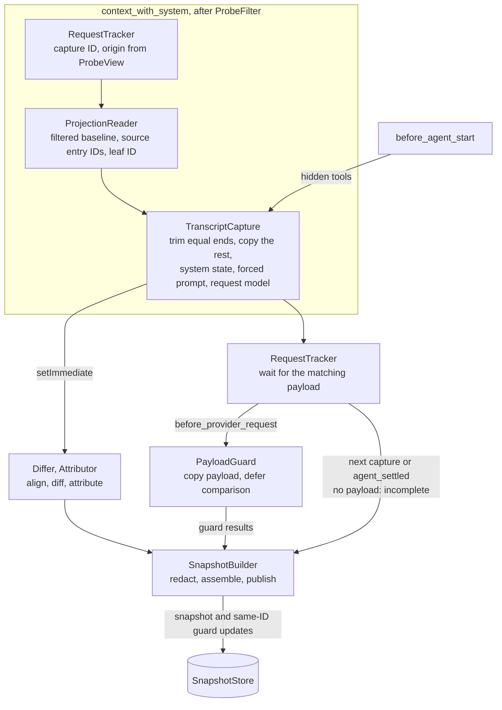

# Structured Request Capture

Part of the [architecture](../ARCHITECTURE.md). Capture describes every agent
request as structured changes against the session projection and publishes
them as request snapshots to SnapshotStore. It runs in every run mode,
independently of any consumer. The [payload guard](payload-guard.md) then
compares the same request with its provider payload.

## Scope

Capture observes every agent request: user prompts, tool follow-ups, runs that
other extensions start, and [silent probe](probe.md) runs. It detects
additions, modifications, and deletions that extensions make to conversation
messages, system prompt content, and tool declarations for one request without
saving them in the session.

The baseline is Pi's canonical session projection. Persistent contributions
are already in that baseline and cancel out of the diff: stored custom
messages, `context_edit` entries, compaction and branch summaries, boundary
entries, recorded prompt/tool changes, and finalized message or tool-result
replacements. The forced system prompt and hidden tool declarations are in
scope too: Pi applies these request-only changes on an extension's behalf.

| Request-only change                                        | Seen by                                     | Attribution                              |
| ---------------------------------------------------------- | ------------------------------------------- | ---------------------------------------- |
| `context` handler, any load position                       | Structured diff                             | `customType` heuristic                   |
| `context_with_system` handler before the monitor           | Structured diff                             | `customType` heuristic                   |
| `context_with_system` handler after the monitor            | Payload guard, text only                    | None                                     |
| `before_provider_request` handler before the monitor       | Payload guard, text only                    | None                                     |
| `before_provider_request` handler after the monitor        | Not visible                                 | None                                     |
| Forced prompt from `before_agent_start`, any load position | Structured, through `ctx.getSystemPrompt()` | None                                     |
| Hidden tool declarations from `prepareLoadout()`           | `before_agent_start` prompt options         | Pi's loadout; the hiding tool is unknown |
| Pi's model-specific adjustments                            | Normalized, not reported                    | Not applicable                           |
| Cache-warm refresh                                         | Marked and skipped                          | Not applicable                           |
| The monitor's own probe-message filter                     | Applied to both sides, not reported         | Not applicable                           |

"The monitor" is this extension's handler on that event;
[Handler Order](pi-requests.md#handler-order) decides which handlers run before it.

## Components

| Component         | Module                       | Hook                                                                                                            | Responsibility                                                                                    |
| ----------------- | ---------------------------- | --------------------------------------------------------------------------------------------------------------- | ------------------------------------------------------------------------------------------------- |
| RequestTracker    | `src/capture/tracker.ts`     | `context_with_system`, `cache_warming_decision`, `before_provider_request`, `agent_settled`, `session_shutdown` | Number captures, set the origin, pair payloads, mark warm refreshes, settle unpaired captures     |
| ProjectionReader  | `src/capture/request.ts`     | Inside `context_with_system`                                                                                    | Read filtered baseline messages, their source entries, and the leaf ID                            |
| TranscriptCapture | `src/capture/request.ts`     | `context_with_system`                                                                                           | Trim equal ends against the baseline; copy the rest; record a forced prompt and the request model |
| Hidden tools      | `src/capture/register.ts`    | `before_agent_start`, copied into each capture                                                                  | Record Pi's hidden set, including for probes with no payload                                      |
| Differ            | `src/capture/diff.ts`        | Deferred                                                                                                        | Compare system state and align conversation messages                                              |
| Attributor        | `src/capture/attribution.ts` | Deferred                                                                                                        | Label changes from `customType` and cooperative provenance                                        |
| SnapshotBuilder   | `src/capture/builder.ts`     | Deferred                                                                                                        | Redact, assemble, and publish snapshots and their guard updates; release copies                   |

The payload guard's components are listed in
[payload-guard.md](payload-guard.md#components).

## Capture Flow

The handler observes every request and returns nothing. It reads the baseline
and compares and copies the request synchronously; diffing and payload
comparison are deferred.



The deferred diff and payload comparison have no fixed completion order. The
first snapshot has guard `pending` unless a guard result is already available;
later results republish the same ID. Warm refreshes are skipped by the payload
pairing branch. A request whose changes cannot be cloned is not captured; the
request itself continues unchanged.

## Baseline

Read `ctx.sessionManager.buildSessionProjection()` inside the capture handler.
This edit-aware projection is what Pi rebuilds each request from, and the
context chain starts from a deep copy of it. It includes every persistent
contribution without depending on this extension's load position, and it
supplies the source entry of each message.

Remove recorded probe messages from the baseline with the filter ProbeFilter
applies to the request ([probe messages](probe.md#keeping-probe-messages-out-of-real-context)).
The filter is this extension's own change: it is not a finding. Record the
session leaf ID with the capture, so consumers rebuild this baseline later with
`buildSessionProjection(entries, leafId)` instead of the snapshot retaining it.
Session entries are append-only, so the rebuild returns the same messages.

With no request-only changes, the structured diff is empty after first and
later prompts, tool follow-ups, resume with another model, compaction, and
silent probes.

## Request Copy

Capture runs on `context_with_system` because there the request still has its
roles, `customType`, `details`, and system sections, and every `context`
contribution has reached it. Later handlers share the same message array,
content blocks, and tool schemas and may edit them in place, so the handler
cannot keep references and defer all work.

- **Observe only.** The handler returns nothing and changes no event data.
- **Compare in place, copy what differs.** Non-system messages equal to the
  baseline at both ends of the conversation are compared in place and never
  copied, so an unchanged request copies no conversation message. The handler
  uses a direct comparison that agrees with the diff keys below; anything
  outside plain JSON data falls back to comparing the keys. `structuredClone`
  copies the rest, the request's replayed system state, and each historically
  declared tool's latest definition.
- **Positions for the guard.** The copy keeps the matched prefix length and
  each system message's text, sections, and position among non-system
  messages. The payload guard rebuilds the compared request from those
  positions, the baseline ends, and the copied rest. Historical declarations
  are needed for OpenAI grammar calls even after a tool is removed; they come
  from this request, not from baseline history a handler may have collapsed or
  replaced.
- **Request model.** The capture copies `ctx.model`'s provider, API, and model
  ID, its `input`, and its top-level `compat` flags for the guard.
- **Failure.** A request whose differing messages cannot be cloned, for example
  because a handler added a function value, is not captured; the request itself
  proceeds unchanged.
- **Deferred work.** Alignment, attribution, redaction, and publication run in
  `setImmediate`. `session_shutdown` cancels scheduled work.

## Forced Prompt

A forced prompt is not in the captured transcript. Detect it by comparing
`ctx.getSystemPrompt()` with `getCurrentSystemPrompt(baseline)` and record the
differing effective text as a structured request-only change. Pi projects that
text after the final `context_with_system` handler, replacing all system
messages with one leading message that holds the forced text and the current
tools. Section patches in the captured transcript therefore do not reach that
request; the payload guard applies the same projection. Pi keeps the run's
prompt options until the run settles, so detection also works in probe runs.

Pi turns every `systemPrompt` returned from `before_agent_start` into a forced
prompt, including the common `event.systemPrompt` plus appended text. Pi never
records that text, so only the snapshot holds it.

## Diff

Request messages have no stable IDs. Compare system state and conversation
separately. Both sides exclude recorded probe messages.

### System State

Replay each side with Pi's `getCurrentSystemMessage()`: append plain `content`,
patch named `sections` (`null` removes one), and apply `toolsRemoved` before
`toolsAdded`. Compare plain content, sections, and tool declarations
separately. Replay makes Pi's collapsed leading system message after a
changing `context` handler equivalent to the sequence it replaced, so that
collapse is not an extension edit. Replay loses system-message placement; the
payload guard keeps positions separately. A forced prompt is compared from its
captured text, not from replayed sections.

### Conversation

Exclude system messages. Key each message by role, `customType`, and canonical
JSON of its model-facing part; timestamps, `details`, `display`, and usage are
ignored. After the equal ends are removed in the handler, a Myers diff aligns
the keys of the rest, so the edits match a diff of both whole sides.

- An unmatched request message is an addition; an unmatched baseline message a
  deletion.
- A deletion and an addition with the same role between the same aligned
  messages are a modification.
- A message whose exact copy is deleted elsewhere is never paired, so a reorder
  stays a deletion plus an addition.
- Modifications and deletions reference their baseline message's source entry,
  so consumers can apply them to a later projection.

## Attribution

Pi exposes no per-handler observation hook, so attribution is best-effort.
Only a custom message names a source: its `customType`, plus `details.source`
and `details.reason` when an extension provides them. `details` is never sent
to the model. Everything else is unattributed. For a modification or deletion,
these fields describe the affected message, which names its owner, not the
extension that edited it.

Neither `customType` nor `details` proves ownership: any extension can reuse
them. `customType` disappears during provider conversion, so this attribution
exists only in structured capture, never for late edits.

## Hidden Tools

Pi calls a tool's `prepareLoadout()` when active tools change. Its outputs have
different persistence rules:

- `descriptions` replace tool descriptions and are recorded in system messages.
  They belong to the baseline.
- `hiddenDeclarations` removes declarations from each request after
  `context_with_system`, while the tools stay active and callable, for example
  through codemode. This is request-only. Hidden tools are also omitted from the
  recorded prompt's tool list; that prompt change belongs to the baseline.

Pi reports the hidden set as `hiddenTools` in prompt options. Capture reads
`before_agent_start.systemPromptOptions.hiddenTools` and freezes the names into
each request snapshot, independently of payload comparison. A probe records
them without a provider payload. The payload guard excludes these names from
its expected declarations.

Pi does not report which tool requested each exclusion, so there are no
candidate-source labels; do not guess one from `model-only` exposure.

Event contexts have no `getSystemPromptOptions()` method, so capture retains
the last observed list until the next `before_agent_start`, or shutdown. A later
handler or mid-run tool change can make it stale; a continuation without that
event uses the last list (initially empty). Usage instead reads the live list
in its command handler and is not subject to this limitation.

## Snapshots and SnapshotStore

Capture publishes immutable request snapshots; consumers read the store and
never register capture handlers. `src/snapshot.ts` defines the types:

```ts
interface RequestSnapshot {
  readonly id: number; // local capture number; later captures have larger IDs
  readonly origin: CaptureOrigin; // "real-turn" | "synthetic-probe"
  readonly leafId: string | null; // rebuild the baseline with buildSessionProjection(entries, leafId)
  readonly changes: StructuredChanges; // conversation and system changes
  readonly forcedPrompt?: string;
  readonly guard: GuardResult; // "pending" | "complete" | "incomplete"
  readonly hiddenTools?: readonly string[]; // independent of guard status
}
```

- **Numbering.** `turnIndex` restarts with every agent run and cannot identify
  a request, so RequestTracker numbers captures locally. The origin is
  `synthetic-probe` while SilentProbe owns the current run, else `real-turn`.
- **Contents.** A snapshot keeps changed request messages, entry IDs, system
  changes, hidden tool names, the forced prompt, and the guard result. Retained
  messages are [redacted](privacy.md#images-and-provider-signatures).
- **Publication.** Publish a snapshot when its structured diff is ready, with
  guard `pending`. When the guard settles, publish a new object with the same
  ID. Warm refreshes publish nothing.
- **Retention.** SnapshotStore keeps one snapshot, the latest by ID. A
  publication with the same or a higher ID replaces it; an older publication
  only notifies subscribers, so an older guard update cannot replace a newer
  request. The first real request's snapshot releases the probe snapshot.
  `clear()` drops the kept snapshot at `session_shutdown`; subscriptions stay.
- **Updates.** `subscribe()` reports every publication, so a consumer can
  follow each request. ProbeTrigger uses it to wait for its probe snapshot.
- **Copies.** The builder drops its reference to the request copy and baseline
  once the snapshot is built, and keeps the published snapshot only while its
  guard may still change. RequestTracker holds the unpaired capture until a
  payload or settlement; the guard reduces it to comparison data in its first
  deferred job ([retention](payload-guard.md#retention)).

Consumer rules:

- **Selection.** Both views use `latest()`. The command resolves it once,
  checks compaction again, and passes the result to the chosen view
  ([views.md](views.md#resolving-the-snapshot)).
- **No snapshot.** A consumer can ask ProbeTrigger for a probe or show its own
  fallback. Capture never starts a probe, and a fallback never enters the store.
- **Freshness.** A snapshot describes one request; each view applies it under
  its own rules ([one snapshot, two views](views.md#one-snapshot-two-views)).
- **Incomplete guard.** Show a pending or incomplete guard as an unavailable
  comparison, never as "no edits".

## Coverage

The compared request holds every `context` change and the
`context_with_system` changes of extensions loaded before this one. Later
`context_with_system` handlers and payload rewrites are not visible in the
structured diff. The payload guard compares their tool declarations and message
text, up to this extension's own payload handler. Payload handlers after it stay
invisible.
