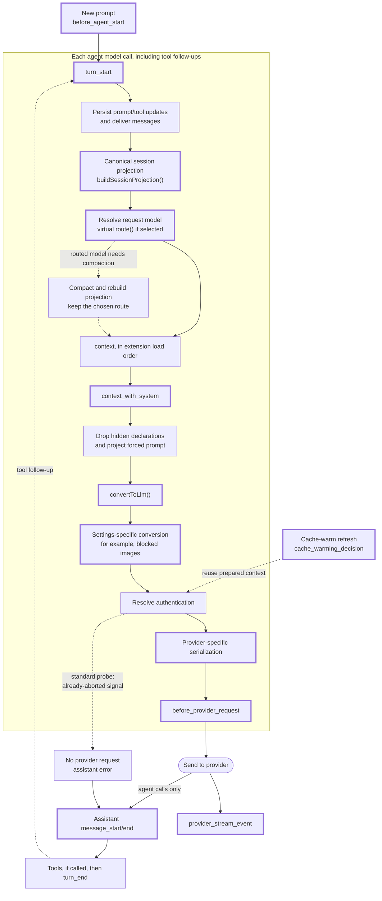

# How Pi Prepares a Request

Part of the [architecture](../ARCHITECTURE.md). This page describes the Pi
behavior that capture and the probe rely on: the request flow, handler order,
the supported Pi versions, the Pi APIs this extension reads, and why running
request preparation has side effects. Checked against Pi `1.1.0`.

## Request Flow

Thick borders mark steps used by `pi-context-view`; the table below explains
its role. Dotted arrows show conditional paths. The two response-event nodes
have no fixed order.

| Step | pi-context-view |
| ---- | --------------- |
| `before_agent_start` | Probe claims its run; capture copies Pi's `hiddenTools` ([hidden tools](capture.md#hidden-tools)). Pi's handlers can inject messages and change prompt options. |
| `turn_start` | Probe aborts its run; context preparation still continues ([probe lifecycle](probe.md#probe-lifecycle)). |
| Message delivery | Persistent prompt/tool updates and delivered messages enter the baseline. Probe blanks its own messages in `message_end`. |
| Session projection | Capture reads the branch baseline inside `context_with_system`, including compaction, context edits, and custom messages ([baseline](capture.md#baseline)). |
| Request model | Capture records `ctx.model` inside `context_with_system`. A virtual selection stays selected while `route()` chooses the physical model ([request model and dispatch](payload-guard.md#request-model-and-dispatch)). |
| `context` | Not observed directly. Pi passes each handler's conversation changes onward and restores system state afterward. |
| `context_with_system` | ProbeFilter removes known probe identities, preserving system positions; capture then copies the structured request and records any forced prompt ([request copy](capture.md#request-copy)). |
| Hidden declarations and forced prompt | Pi applies the hidden set and forced text after capture; the guard reproduces these projections ([Pi's own adjustments](payload-guard.md#pis-own-adjustments)). |
| `convertToLlm()` | Used for estimates, previews, and the guard. Pi converts custom, bash, and summary messages and drops bash executions excluded from context. |
| Settings conversion | Guard reads `images.blockImages` at the payload hook and accounts for Pi's image placeholders. |
| Provider serialization | Guard accounts for Pi's provider-specific text adjustments before comparison ([Pi's own adjustments](payload-guard.md#pis-own-adjustments)). |
| `before_provider_request` | Guard pairs and copies the payload, then compares tools and messages. Other handlers may replace the outgoing payload ([pairing](payload-guard.md#pairing)). |
| `provider_stream_event`, assistant messages | Guard confirms the dispatch identity from the first stream event or assistant `message_start`; assistant `message_end` is the fallback. |
| Cache-warm refresh | Marked and skipped: no new capture or published snapshot ([warm refreshes](payload-guard.md#warm-refreshes)). |

A standard [silent probe](probe.md#what-a-probe-run-reaches) reaches capture
and both conversion steps. Authentication then rejects its already-aborted
signal. It produces assistant events but no provider request or provider
stream events.

This is a simplified flow. Pi rebuilds each request from the canonical session
projection. It can also compact history, route virtual models, and deliver
queued messages between requests. If the routed physical model requires
compaction, Pi compacts and rebuilds before it continues.
`before_agent_start` runs for a new prompt, while `context` and
`context_with_system` run before each model call, including tool follow-ups.

Pi's `context` handler chain starts with a deep copy of the messages. Its result
is used for that request, not written back into session history. Rebuilding the
session branch later cannot recover those request-only changes.

`context` excludes system messages. Pi restores its prompt and tool state after
each handler; when a handler changes the conversation, that state becomes one
leading replayed system message. `context_with_system` sees the full transcript
and owns the result. Hidden declarations and the forced prompt are projected
after it, before conversion and serialization.

Within an event, handlers run in extension order and see previous handlers'
results. Across preparation events, the sequence is fixed regardless of load
order. Capture relies on that separation, not on being first or last.

On the response side, `after_provider_response` reports the HTTP status; the
OpenAI and Anthropic adapters skip it for error statuses their SDK rejects.
Both `provider_stream_event` and assistant `message_start` identify the
dispatched provider, API, and model, in no fixed order. Assistant `message_end`
carries that identity too, including for failures.

A cache-warm refresh resends the latest request after a
`cache_warming_decision`. It fires `before_provider_request` and provider
events, but no context, turn, or assistant-message events.

Compaction and branch-summary requests, nested calls through
`ctx.modelRegistry`, router classifier calls, and image generation are separate
requests, not contributions to the agent's context. They do not fire the
agent's `before_provider_request` event. Nested tool results from
`ctx.executeTool()` reach only the calling tool; they do not directly enter the
request.

## Handler Order

No extension can claim a global handler position, and no priority option
exists. Handlers follow configured resource order, not factory execution time:

1. Command-line `-e` extensions, in the given order; explicit `builtin:<name>`
   entries follow other command-line extensions.
2. Project `extensions` settings entries.
3. Project `.pi/extensions/` auto-discovery, in file-name order.
4. Personal `extensions` settings entries.
5. Agent-directory `extensions/` auto-discovery, in file-name order.
6. Packages: project, then personal, each in settings order; files within a
   package follow manifest order.
7. Remaining built-ins: llama.cpp, codemode, tool-search, mcp.

Project factories run after trust is resolved but keep these handler
positions. For the latest package position, install personally and place the
package last in the personal `packages` list. A later position widens capture
coverage; it does not guarantee observation of every payload rewrite.

The position also bounds the silent probe. Its `input` reset undoes only
transforms from earlier extensions
([run identity](probe.md#identifying-the-probe-run)), and ProbeFilter hides
probe messages only from later handlers
([probe messages](probe.md#keeping-probe-messages-out-of-real-context)).

### Built-in Extensions

Built-ins load as `builtin:<name>` at the positions above and follow the same
capture rules as third-party extensions. Codemode, tool search, MCP, and
llama.cpp register no `context`, `context_with_system`, or
`before_provider_request` handlers. MCP writes its `mcp_servers` prompt section
through `systemPromptOptions`, so it belongs to the baseline; llama.cpp
registers a provider. Codemode's hidden declarations reach the views through
Pi's `hiddenTools` ([hidden tools](capture.md#hidden-tools)).

## Supported Pi Versions

This extension requires Pi `1.1.0` or newer. It relies on `context_with_system`
filtering, `turn_end` omission edits, `hiddenTools` in Pi's prompt options, and
the probe's [abort form](probe.md#keeping-probe-messages-out-of-real-context).
The Pi packages stay `"*"` peer dependencies, so an older Pi can still load
the extension. The factory therefore compares Pi's `VERSION` with
`MIN_PI_VERSION` and, on an older Pi, registers no lifecycle handlers: nothing
is captured, probed, or filtered. Every `/context` form, including `config`,
then reports the required and running versions as an error and does nothing
else. A version without a numeric `major.minor.patch` core is treated as
supported.

## Pi APIs Used

- `ctx.sessionManager.buildSessionProjection().messages` supplies the current
  branch's conversation messages, with compaction and context edits applied.
  Do not estimate usage directly from `buildContextEntries()`: it also returns
  bookkeeping records such as model changes, bookmarks, and saved extension
  state. Pi does not send those records to the model, so they must not
  contribute to token estimates.
  **Goal:** count current session messages in Usage and identify request-only
  changes by comparing this list, with source entry IDs, with each captured
  request.

- `ctx.getSystemPrompt()` reads Pi's effective prompt during a run, including
  `before_agent_start` edits and a forced prompt, which Pi renders instead of
  the structured sections. Pi clears per-run options on settlement, so an idle
  read is not the prompt used by the last request. It does not expose later
  provider-payload rewrites.
  **Goal:** detect a forced prompt during capture, and provide a view fallback
  only when the branch has no system messages.

- `ctx.getSystemPromptOptions()` reads the base prompt construction options in
  a command handler, including `hiddenTools` from Pi's current loadout.
  **Goal:** keep `customPrompt` Dropped markers in Injections, measure the
  live fallback, and leave out hidden tools in Usage before any provider request.

- `before_agent_start.systemPromptOptions.hiddenTools` reports Pi's hidden
  declarations to event handlers. Capture copies this list for the run and
  into each request snapshot, independently of payload comparison.
  **Goal:** leave hidden tools out of the captured request and count them,
  including for a silent probe.

- `pi.getActiveTools()` and `pi.getAllTools()` supply the active tool names,
  definitions, and source information. `pi.getCommands()` supplies additional
  extension source information for prompt attribution.
  **Goal:** provide the views' live fallback and tool provenance.
  For transcript-backed views, recorded declarations supply definitions and the
  active set; current registration metadata supplies provenance and guideline
  attribution only. Unregistered recorded tools stay visible as unattributed.
  Tool and command source information also supports prompt-addition guesses.

- `convertToLlm()` supplies the text Pi sends for bash and summary messages.
  It does not run extension handlers or build the final provider payload.
  **Goal:** estimate bash and summary messages using Pi's formatted text, and
  build captured bash previews without unrelated message metadata. The payload
  guard also uses it to convert the rebuilt captured request before comparison.

- `getCurrentSystemMessage()` and `getCurrentSystemPrompt()` from
  `@earendil-works/pi-ai` replay recorded system messages as Pi does.
  **Goal:** compare system state in capture, and rebuild the prompt and tools
  in both views.

- `ctx.getContextUsage()` supplies Pi's reported usage and context window
  separately from this extension's category estimates.
  **Goal:** show Pi's usage in the header and scale the map against the model's
  context window, without replacing the category estimates.

## Why Preparing a Request Can Have Side Effects

Before Pi sends a request to the model, other extensions can change its system
prompt, active tools, or messages. They do this in functions registered for
Pi events such as `before_agent_start` and `context`. These functions are the
**event handlers** mentioned in these pages.

`pi-context-view` needs to observe the results of these handlers to capture
injected content and estimate its size. Reading the saved conversation alone
is not enough: an extension can add or replace content only in the outgoing
request, without saving those changes in the conversation.

However, running the handlers again to refresh a view would execute extension
code, not just read data. For example, a handler could:

- Add a message to the saved conversation.
- Update its own state, changing what it does on the next real turn.
- Write a file, create a checkpoint, show a notification, or make a network call.

Opening `/context` should not repeat those actions every time. Pi copies the
messages before running `context` handlers, but that copy only protects the
original message list. It does not prevent the other actions above.

Starting a new run also delivers pending messages and calls `input`,
`before_agent_start`, and turn handlers. Aborting before the model request is
sent does not undo actions that those handlers have already performed.
**Pi has no API for extensions to prepare the complete next request without
risking such side effects.**

`pi-context-view` therefore captures requests while Pi is already preparing
them for your prompts. This avoids starting another run, and repeating other
extensions' actions, just to inspect the context. If you open a view before any
request snapshot exists, it can make one explicit
[silent probe](probe.md), limited to one attempt per extension runtime.

## References

- [Extensions](https://pi.dev/docs/latest/extensions) and
  [event types](https://github.com/earendil-works/pi/blob/main/packages/coding-agent/src/core/extensions/types.ts):
  lifecycle and extension contracts.
- [Session format](https://pi.dev/docs/latest/session-format): persistent
  entries and projection.
- [Virtual models](https://github.com/earendil-works/pi/blob/main/packages/coding-agent/docs/virtual-models.md):
  selection, dispatch, and routing.
- [Pi packages](https://pi.dev/docs/latest/packages),
  [configuration](https://pi.dev/docs/latest/configuration), and
  [settings](https://github.com/earendil-works/pi/blob/main/packages/coding-agent/docs/settings.md):
  loading, dependencies, retries, and warming.
- Pi source: [`coding-agent/src/core`](https://github.com/earendil-works/pi/tree/main/packages/coding-agent/src/core)
  for projection, request-model resolution, extension dispatch, and cache
  warming; [`agent-loop.ts`](https://github.com/earendil-works/pi/blob/main/packages/agent/src/agent-loop.ts)
  for assistant-message events; [`ai/src`](https://github.com/earendil-works/pi/tree/main/packages/ai/src)
  for transcript helpers, provider hooks, and serialization.
