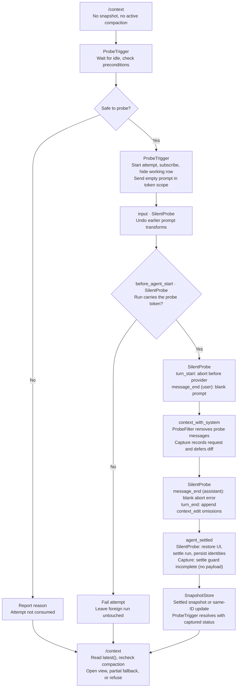

# Silent Probe

Part of the [architecture](../ARCHITECTURE.md). A silent probe starts an agent
run so that [capture](capture.md) can observe request preparation before the
user sends a prompt. Capture handles probe runs with the same handlers as
other runs; only the snapshot origin, `synthetic-probe`, differs.

## Why It Is Needed

Before a real turn, Pi's APIs can supply the current prompt, tools, and saved
session messages. That is enough for a partial view, but not for a request
snapshot. Without running a turn, this extension cannot observe:

- `before_agent_start` changes for that run: prompt edits, injected messages,
  and tool activation;
- request-only messages and transformations from `context` handlers and earlier
  `context_with_system` handlers.

Reading session history or calling `convertToLlm()` does not run those
handlers. The silent probe starts the lifecycle so capture can see them, then
aborts before a provider request. A probe uses the same capture handlers as a
real turn, so it does not widen capture coverage. An empty-input probe also
cannot reveal contributions that run only for a particular real prompt.

If the store holds a snapshot, neither view needs a probe. Either view can
request the shared one automatic attempt when the store is empty. Never probe
in the background or repeat it on every view open: a probe runs other
extensions' handlers ([side effects](#side-effects)).

## Probe Layer

| Component    | Module                      | Hook                                                                                                                         | Responsibility                                                                               |
| ------------ | --------------------------- | ---------------------------------------------------------------------------------------------------------------------------- | -------------------------------------------------------------------------------------------- |
| ProbeFilter  | `src/probe/filter.ts`       | `session_start`, `context_with_system` before capture                                                                        | Restore persisted identities; remove recorded probe messages from requests and baselines     |
| SilentProbe  | `src/probe/silent-probe.ts` | `input`, `before_agent_start`, `turn_start`, `message_start`, `message_end`, `turn_end`, `agent_settled`, `session_shutdown` | Claim, abort, blank, and omit its own run; record identities in ProbeFilter and persist them |
| ProbeView    | `src/probe/view.ts`         | None                                                                                                                         | The run origin and probe-message filter that capture reads                                   |
| ProbeTrigger | `src/probe/trigger.ts`      | Called by the command                                                                                                        | Apply the preconditions and the automatic policy; start SilentProbe; wait for its snapshot   |

- **ProbeFilter** stays active even when no probe runs, because sessions keep
  probe messages from earlier runtimes.
- **SilentProbe** runs one probe: run identification by token, abort, message
  blanking, `turn_end` omission edits, and persisted identities.
- **ProbeTrigger** decides when to probe. The automatic policy allows at most
  one attempt per extension runtime; concurrent and later callers share its
  result. The command asks it only while the store holds no snapshot.
  ProbeTrigger has no run-mode guard; the command keeps the TUI-only check.

## Probe Lifecycle

This shows a new automatic attempt on Pi's standard runtime. The owned-run
path assumes correct run recognition; [nested sends](#known-limitation-nested-sends)
can break it.

Subscribing before sending prevents missed publications. ProbeTrigger resolves
with `{ status: "captured" }` only after the first `synthetic-probe` snapshot's
guard has settled; one probe runs at a time, so that snapshot belongs to this
attempt. Capture publishes when its deferred diff is ready: it may publish a
pending snapshot followed by a same-ID update, or an already-incomplete snapshot
if settlement happens first.

SilentProbe's outcome reports only whether its run settled or failed, not
whether capture succeeded. Capture's `agent_settled` handler runs after
SilentProbe's, so ProbeTrigger allows up to one second after run settlement
before reporting a missing snapshot. The cached attempt holds only the result,
never the snapshot, so it cannot keep a replaced probe snapshot alive. The
command reads `latest()` after resolution and checks compaction again; active
compaction refuses the view instead of opening either the view or its fallback.
ProbeTrigger restores the working row in `finally` on every started attempt's
outcome.

Use `sendUserMessage("")`. `pi.sendMessage(..., { triggerTurn: true })` skips
`before_agent_start`. Abort at `turn_start`, not `before_provider_request`:
some transports skip the payload hook, and a standard probe never reaches it
([below](#what-a-probe-run-reaches)).

## What a Probe Run Reaches

For a physical model on Pi's standard runtime, the aborted run still:

- prepares structured context through `context`, `context_with_system`, hidden
  declarations, the forced prompt projection, and `convertToLlm()`;
- enters the agent stream function, which starts cache-warming bookkeeping;
- fails authentication resolution on the already-aborted signal, before
  `before_provider_headers`, `before_provider_request`, or the provider stream
  implementation;
- ends with an assistant error naming the physical provider, API, and model.
  `after_provider_response` and `provider_stream_event` do not fire.

A probe therefore gets the structured capture, but normally no payload. Its
guard settles incomplete at `agent_settled`; consumers must not wait for a
payload. If a nonstandard host reaches a payload hook, the guard pairs it
normally. SilentProbe blanks the assistant message in `message_end` while
keeping its provider, API, and model.

Virtual selections are skipped before probing. If another extension switches to
one during preparation, its `route()` receives the aborted signal and can stop
before context handlers or perform side effects. The preconditions cannot lock
other extensions' behavior.

## What a Probe Snapshot Represents

A probe snapshot approximates the next request for a user prompt:

- The prompt is empty, so contributions that depend on its text are missing or
  different.
- Tool follow-up requests skip `before_agent_start` and may differ.
- The probe run delivers pending messages and persists the prompt and tool
  loadout update. Later snapshots see them in the baseline.

A later `real-turn` snapshot replaces it as the latest snapshot. Injections
labels probe snapshots as probes.

## Identifying the Probe Run

The probe has to know which agent run is its own. Prompt text cannot answer
that question: any other extension can rewrite the text in an `input` transform
before Pi reports it. Emptying the prompt in this extension's own `input`
handler does not settle it either, because that only undoes transforms from
extensions loaded before this one.

Use the call's async context to correlate the run. Each attempt gets its own
token, and the command sends the synthetic prompt inside an `AsyncLocalStorage`
scope holding that token. Pi emits `input` and `before_agent_start` from inside
that same call, so both handlers can read the token even after an input
transform changes the prompt. One run may claim a token, and after that no
later run can. This assumes no nested send claims the token first: async
context is not a unique per-prompt identity.

Treat every run without the token as someone else's. Fail the attempt and show
the fallback, but let that run continue: it may be the user's prompt or another
extension's message, so never abort or rewrite it.

Keep watching for the probe run after the attempt ends. The attempt can end
early, on timeout or because a foreign run failed it, while the probe's own run
is still on its way. That run still carries the token, so it is still claimed,
aborted, and sanitized.

The token stays in this process. Never persist, render, or log it.

### Known Limitation: Nested Sends

`AsyncLocalStorage` propagates the token to async work started inside its
scope, including another extension's nested `pi.sendUserMessage()` call. It
does not identify only the original synthetic prompt, and descendant work can
keep the token after the outer `sendUserMessage()` call returns.

For example, another extension's async `input` handler can send a separate
message and wait briefly before returning:

1. The nested send inherits the probe token. While the probe is waiting, its
   input handler can erase the nested message's text.
2. The nested run reaches `before_agent_start` first and claims the token. It
   is aborted, and its messages are blanked and recorded as probe identities.
3. If that run settles before the original input handler returns, the probe
   state becomes `settled`.
4. The original synthetic prompt then reaches `before_agent_start`, but cannot
   claim the already-used token. Its abort guard stays inactive, so it can
   make a provider request and remain in later context as an ordinary message.

The token approach is more robust against text transforms than the previous
empty-input checks, which lost recognition when another extension added text
([issue #5](https://github.com/dimk90/pi-context-view/issues/5)). It also avoids
claiming unrelated empty inputs outside the token scope. It is **not
fail-safe**, however: nested sends can be mistaken for the probe, including
non-empty sends that the old checks would have left alone. A timeout or
fallback does not fix that ownership mistake or guarantee that the original
probe is aborted.

## Keeping Probe Messages Out of Real Context

Track synthetic user and assistant messages by exact role and timestamp.
Never identify them by empty content: genuine empty messages and genuine aborts
must remain visible.

Blank both recorded probe messages in `message_end`: the synthetic prompt,
which may carry text an input transform added, and the assistant abort result.
Blanking removes their content before Pi stores the messages.

At the owned run's `turn_end`, append `context_edit` drafts with
`replacement: null` and the exact session entry IDs of known probe messages that
are still visible in `event.context.contextEntries`. That boundary projection
already applies compaction, earlier edits, and earlier handlers' drafts, so each
visible target is omitted once. Preserve other handlers' proposed entries and do
not request continuation. Pi applies these omissions to future context even
when this extension is absent. The raw blank messages remain in the session
tree. Use `turn_end`, not `agent_before_settle`: an explicit abort skips the
latter boundary.

Targets include identities restored from earlier runtimes. An omission persists
in the session file and outlives this extension, so a genuine message whose role
and timestamp match a probe identity would stay omitted, not only filtered in
memory. Such a collision needs the same millisecond timestamp; exact identities
keep it unlikely.

Keep identity filtering for Usage, capture baselines, and requests. Omission
edits are branch-relative: navigating before an edit can reveal a probe entry
again. Old sessions and an interrupted run may also lack omissions. ProbeFilter
filters requests in its own `context_with_system` handler, registered before
capture's, and returns nothing when no identity matches. Pi uses that handler's
result as returned, so system messages keep their positions, and providers
with mid-conversation system messages keep their cached prefix. A changed
`context` result would collapse Pi's system messages into one leading message
on every request. `context` handlers and earlier `context_with_system` handlers
can still see blank probe entries that have not been omitted from the
projection. During the probe itself, the filter removes its prompt from the
request.

Pi reports the probe's `turn_start` abort with an `error` stop reason:
authentication rejects the already-aborted signal before streaming. Its error
message is the `AbortError` text of the JavaScript runtime that runs Pi:

| Runtime                    | Error message                |
| -------------------------- | ---------------------------- |
| Node.js                    | `This operation was aborted` |
| Bun (standalone pi binary) | `The operation was aborted.` |

Blank such an error only for a recorded probe assistant with one of these exact
messages. Any other stop reason, including `aborted`, provider errors, and
cancellations of runs the probe does not own, remains visible. A runtime with
other wording leaves the error row visible: add its exact message instead of
matching abort text loosely.

Blanking cleans agent state, later model contexts, and the saved session, but
not the current screen: Pi renders a user row when the message starts and does
not repaint it for a `message_end` replacement. Text another extension's input
transform added to the probe prompt therefore stays visible for that run and
disappears on reload or resume. Nothing of that text is sent or stored.

Persist only role-and-timestamp identities in
`pi-context-view:probe-identities` custom entries on `agent_settled` and
`session_shutdown`. Restore all prior identities on `session_start`, including
after resume, reload, and fork. Omission edits persist only target entry IDs
and `null`. Neither record stores content.

## Preconditions, Failures, and Fallback

Pi's `waitForIdle()` includes compaction. Still recheck the tracked lifecycle
after waiting, because compaction can start before the probe is sent. Track
`session_before_compact` until its signal aborts or Pi reports
`session_compact` or `session_compact_failed`; do not infer completion from a
later agent run.

Pi runs extension commands at once during compaction, so `/context` checks the
tracked lifecycle itself. While compaction is active, both views are refused
with a warning and do not open: compaction is about to replace the session
projection they read. The command checks before resolving its snapshot, so it
never waits for compaction, and again after, because compaction can start
while it waits for idle. The second check replaces that probe fallback with the
refusal.

Before starting or consuming an attempt, use the fallback when:

- compaction is active or `ctx.hasPendingMessages()` reports queued input;
- the selected model is virtual (`api: "pi-virtual"`), since routing can make
  classifier calls or fail before capture;
- idle cache warming is enabled, since its refresh uses a separate abort signal;
- known context usage exceeds `contextWindow - reserveTokens` while automatic
  compaction is enabled, using Pi's `shouldCompact()` and per-model settings;
- Pi settings cannot be checked safely.

Compaction settings come from `pi.getSettings()`, so runtime changes apply; the
Usage map's auto-compaction reserve reads the same source. The warming check
also reads global settings with project settings disabled: Pi's warming mode is
global-only, but the merged API can hide it under an ignored project override.
An idle value in either source triggers fallback. Extensions cannot see an SDK
host's custom agent directory, so this file read uses Pi's default directory,
which honors `PI_CODING_AGENT_DIR`; an unsaved runtime warming change hidden by
a project override is also missed. Never write or change Pi settings to make a
probe possible.

These are conservative checks, not a lock on Pi or other extensions. Unknown
usage does not block probing; pre-prompt overflow recovery, hidden `nextTurn`
messages (not reported by `hasPendingMessages()`), later model or settings
changes, and arbitrary extension side effects remain possible. Default
`streaming` warming remains enabled in Pi and stops on settlement; slow
handlers or other extensions can still affect it. The nested-send ownership
limitation also remains. Strict zero-provider-request guarantees require
passive capture.

Any skipped precondition above, a missing model, missing authentication, a
startup failure, a timeout, or a probe that settles without a request snapshot
reports a precise reason that extension additions were not observed.
Injections then shows a current prompt/tool snapshot; Usage counts the current
branch without request changes. Neither fallback enters the store.

Always restore the working-row state in `finally`. If the probe times out,
keep tracking its run until it settles: delayed synthetic messages must still
be sanitized and filtered.

## Side Effects

"Silent" means that the probe's own run sends no provider request and leaves
no transcript text. This depends on correct run recognition: the
[nested-send limitation](#known-limitation-nested-sends) can break that
guarantee. It does **not** mean that the probe has no side effects, which is
why it is explicit and limited to one attempt rather than a way to refresh
Usage repeatedly:

- Other extensions' input, agent, context, message, and turn handlers run.
  Provider header and payload handlers normally do not run because
  authentication rejects the aborted signal first.
- Virtual-model routing can make classifier calls and persist routing state;
  the trigger skips virtual selections, but later model changes remain
  possible.
- Pi's pre-prompt compaction check runs before `before_agent_start` and can
  start auto-compaction, which sends a summary request. The context-usage
  precondition approximates Pi's threshold check; it cannot predict every case.
- The agent stream function starts warming bookkeeping and cancels the warm run
  of the last real request. Default `streaming` warming stops at settlement;
  the trigger skips idle warming. Slow handlers, later settings changes, and
  other extensions can still affect this path.
- A `context_edit` makes Pi distrust earlier reported usage, so its next
  pre-prompt compaction check and `getContextUsage()` estimate the context size
  until a later response reports usage again.
- Omission edits persist in the session and outlive the extension; raw blank
  entries remain in history.
